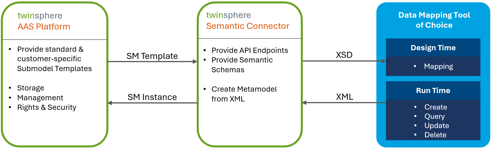

# Semantic Connector

The twinsphere Semantic Connector enables a simplified generation of submodels. It offers a simplified format of
submodel templates which makes mapping of your data to submodel properties much easier. The resulting mapped data is
then converted back to a standard conform, valid submodel instances and stored in the twinsphere repository.

{: width='800' }

Here is an example of some properties of the digital nameplate submodel, first in the original form of the metamodel and
then in our semantic representation.

<!-- markdownlint-disable no-inline-html -->

<table>
<tr>
<th>Standard JSON</th>
<th>twinsphere Semantic XML</th>
</tr>
<tr>
<td valign="top">
```json
{
  "idShort": "Markings",
  "semanticId": {
    "type": "ExternalReference",
    "keys": [
      {
        "type": "GlobalReference",
        "value": "0173-1#01-AGZ673#001"
      }
    ]
  },
  "value": [
    {
      "idShort": "Marking00",
      "semanticId": {
        "type": "ExternalReference",
        "keys": [
          {
            "type": "GlobalReference",
            "value": "0173-1#01-AHD206#001"
          }
        ]
      },
      "value": [
        {
          "idShort": "MarkingName",
          "semanticId": {
            "type": "ExternalReference",
            "keys": [
              {
                "type": "GlobalReference",
                "value": "https://admin-shell.io/zvei/nameplate/2/0/Nameplate/Markings/Marking/MarkingName"
              }
            ]
          },
          "valueType": "xs:string",
          "value": "0173-1#07-DAA603#004",
          "modelType": "Property"
        },
        {
          "idShort": "IssueDate",
          "semanticId": {
            "type": "ExternalReference",
            "keys": [
              {
                "type": "GlobalReference",
                "value": "https://admin-shell.io/zvei/nameplate/2/0/Nameplate/Markings/Marking/IssueDate"
              }
            ]
          },
          "valueType": "xs:date",
          "value": "2022-01-01",
          "modelType": "Property"
        },
        {
          "idShort": "ExpiryDate",
          "semanticId": {
            "type": "ExternalReference",
            "keys": [
              {
                "type": "GlobalReference",
                "value": "https://admin-shell.io/zvei/nameplate/2/0/Nameplate/Markings/Marking/ExpiryDate"
              }
            ]
          },
          "valueType": "xs:date",
          "value": "2022-01-01",
          "modelType": "Property"
        }
        ...
      ],
      "modelType": "SubmodelElementCollection"
    }
  ],
  "modelType": "SubmodelElementCollection"
}
```
</td>
<td valign="top">
```xml
  <Markings>
    <Marking>
      <MarkingName>0173-1#07-DAA603#004</MarkingName>
      <IssueDate>2022-01-01</IssueDate>
      <ExpiryDate>2022-01-01</ExpiryDate>
      ...
    </Marking>
  </Markings>
```
</td>
</tr>
</table>

<!-- markdownlint-enable no-inline-html -->

As you can see all complex AAS metadata information is hidden to make the semantic format (which we call "semantic
submodels" or "semantic submodel instances") easy to understand - even for non AAS experts. Simple key/value pairs. We
believe that mapping data to this more comprehensive form should be much easier.

> **REMARK** *Semantic submodels and the value-only serialization of the AAS standard are not the same - even if they
> look similar. The value-only format can not be converted back to its original form, our semantic submodels can!*

Semantic Submodels are described via XML schemas (which we call "semantic submodel schemas"). We derive these schemas
from the structure and rules defined in the submodel templates. An example of such schema is given below:

```xml
  ...
  <xs:complexType name="MarkingsMarkingItem_t">
    <xs:sequence>
      <xs:element name="MarkingName" type="xs:string" maxOccurs="1" minOccurs="1"/>
      <xs:element name="DesignationOfCertificateOrApproval" type="xs:string" maxOccurs="1" minOccurs="0"/>
      <xs:element name="IssueDate" type="xs:string" maxOccurs="1" minOccurs="0"/>
      <xs:element name="ExpiryDate" type="xs:string" maxOccurs="1" minOccurs="0"/>
      <xs:element name="MarkingFile" type="File_t" maxOccurs="1" minOccurs="1"/>
      <xs:element name="MarkingAdditionalText" type="MarkingMarkingAdditionalText_t" maxOccurs="1" minOccurs="1"/>
      <xs:element name="ExplosionSafeties" type="MarkingExplosionSafeties_t" maxOccurs="1" minOccurs="0"/>
    </xs:sequence>
  </xs:complexType>
  <xs:element name="Marking" type="MarkingsMarkingItem_t"/>
  <xs:complexType name="MarkingsMarking_t">
    <xs:sequence>
      <xs:element name="Value" type="MarkingsMarkingItem_t" minOccurs="1" maxOccurs="unbounded"/>
    </xs:sequence>
  </xs:complexType>
  <xs:complexType name="DigitalNameplateMarkings_t">
    <xs:sequence>
      <xs:element name="Marking" type="MarkingsMarking_t" maxOccurs="1" minOccurs="1"/>
    </xs:sequence>
  </xs:complexType>
  <xs:element name="Markings" type="DigitalNameplateMarkings_t"/>
  ...
```

These schemas are especially useful in workflow / mapping tools to create automatic connectors.

## API

> The API follows url-based versioning semantics, for example: /sphere/api/**v1.0**/semantic-connector

Semantic connector is available under `/sphere/api/{api-version}/semantic-connector`.

Take a look at the Swagger for more API documentation around each parameter and return value. Swagger for the semantic
connector is available under `/sphere/swagger/index.html`.

## Semantic Schemas

The derived schemas, which we call semantic schemas, are available under
`sphere/api/{api-version}/semantic-connector/schemas`.

### Supported Submodel Templates

With the first release of our Semantic Connector we offer (bi-directional) support for the following standard submodel
templates:

- Digital Nameplate 2.0
- Contact Information 1.0
- Technical Data 1.2
- Carbon Footprint 0.9
- Handover Documentation 1.2
- Hierarchical Structures enabling Bills of Material 1.1

We are already working on the support of any submodel templates stored in the twinsphere repository - be it published
standard templates or user-defined templates. This feature will be available in Q3 2025.

### Semantic Schema Identifiers

Each schema is identified via its targetNamespace attribute of the top level xs:schema element. The identifier is
structured as follows:

`schema-engine-version/base64(submodel-template-semantic-id)`

For example:

`https://twinsphere.io/semantics/1/0/aHR0cHM6Ly9hZG1pbi1zaGVsbC5pby9aVkVJL1RlY2huaWNhbERhdGEvU3VibW9kZWwvMS8y`

- the `https://twinsphere.io/semantics/1/0` is the schema engine version (produced by twinsphere semantics in version
  1.0)
- the base64 part (`aHR0c...ZWwvMS8y`) is the submodel template semantic id, decoded with value
  `https://admin-shell.io/ZVEI/TechnicalData/Submodel/1/2`.
- therefore, this semantic schema is derived from submodel template Technical Data in version 1.2.

> **IMPORTANT** *The semantic schema uses the semantic ID of the submodel template, and not the ID field of the
> submodel template (these two are often the same, but in some cases they can differ).*

## Semantic Instances

Based on the semantic schemas, you can now read and write submodels in the "semantic" form using the semantic connector.

To perform validation and serialization / deserialization correctly, you just need to always remember to reference the
semantic schema via the xmlns attribute on the root element of the hierarchy, as in the example below:

```xml
<?xml version="1.0" encoding="utf-16"?>
<DigitalNameplate xmlns:xsi="http://www.w3.org/2001/XMLSchema-instance" xmlns:xsd="http://www.w3.org/2001/XMLSchema" xmlns="https://twinsphere.io/semantics/aHR0cHM6Ly9hZG1pbi1zaGVsbC5pby96dmVpL25hbWVwbGF0ZS8yLzAvTmFtZXBsYXRl">
  <Id>testsubmodel</Id>
  <UriOfTheProduct>https://www.domain-abc.com/Model-Nr-1234/Serial-Nr-5678</UriOfTheProduct>
  <ManufacturerName>
    <LanguageString>
      <Language>de</Language>
      <Value>Muster AG</Value>
    </LanguageString>
  </ManufacturerName>
  ...
</DigitalNameplate>
```
