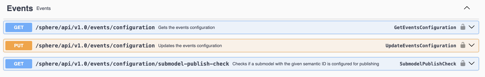

# Events

> ⚠️ **Experimental**
> This is an experimental feature and usage in productive systems is not advised!

Besides the HTTP/REST based API endpoint, twinsphere also offers a MQTT based API for receiving events about
shells and submodels.

An event tells you **that** something changed, not what it changed to. It carries no copy of the shell or
submodel — you read the current state over the REST API when you are ready for it. This keeps events small
and means you always act on current data rather than on a snapshot that may already be stale.

## Configuration

**Everything is published by default** — every shell change and every submodel change, including submodels
that carry no semantic ID at all.

If you do not want to be told about certain submodels, block them. Blocking is configured in the "Events"
section of the `/sphere/swagger/index.html`.



An empty block list means nothing is withheld:

``` json
{
  "publish": {
    "submodels": {
      "blockedSemanticIds": []
    }
  }
}
```

To stop receiving events for a submodel type, add its semantic ID:

``` json
{
  "publish": {
    "submodels": {
      "blockedSemanticIds": [
        "https://admin-shell.io/ZVEI/TechnicalData/Submodel/1/2"
      ]
    }
  }
}
```

A submodel is withheld if **any** of its semantic IDs matches the list. Shell events are never filtered.

A configuration change takes up to a minute to take effect, so you may briefly keep receiving events for a
semantic ID you have just blocked.

### Regex

To use regular expressions instead of exact matches, prefix your semantic ID with "**$regex=**" and provide a
valid regex expression. If you need to use special characters in your pattern (such as *$ / . @ >*) you'll
need to escape them with double backslashes (\\\\).

For example, to block all submodels whose Semantic ID includes "test":

``` json
{
  "publish": {
    "submodels": {
      "blockedSemanticIds": [
        "$regex=^test$"
      ]
    }
  }
}
```

Multiple regex expressions, as well as matching with static strings, is possible.

## Connecting to the broker

Connection is based on mutual-TLS authentication with certificates. At present, we only support the thumbprint matching
strategy.

### Certificate creation

1. Create your own certificate (it can be self-signed or issued by a valid certificate authority, but ensure you store
   this certificate securely as a **SECRET**). You can simply follow this
   [guide](https://learn.microsoft.com/en-us/azure/event-grid/mqtt-publish-and-subscribe-cli#generate-a-sample-client-certificate-and-thumbprint)
   or use a tool of your choice.
2. Send us the thumbprint via a [JIRA ticket request](contact.md). We will provide you with the connection details once
   the thumbprint has been granted access. The thumbprint itself is not a secret, so it can be sent through unsecured
   channels.

> To test out the connection, we recommend using [mqttx.app](https://mqttx.app/)

### Connecting

Any MQTT 3.1 or 5.0 client library in any language is supported. Make sure you understand and distinguish between the
**MQTT client ID** (aka Session ID) and the **username** which you need to provide, like in `WithCredentials()` method
in the C# example below.

Your client ID (session ID) can have any value, but make sure it is fixed and not dynamic. This value will be used to
map the MQTT session back to your client in cases such as restarts and failures.

Here is a generic C# example with MQTTNet on how to establish a connection:

```csharp
const string clientId = "your-fixed-client-id-per-consumer"; // aka Session ID
const string username = "you will get this value from us";

var mqttClientConfiguration = new MqttClientOptionsBuilder()
    .WithClientId(clientId)
    .WithTcpServer(_eventBrokerHost, _eventBrokerPort)
    ...
    .WithCredentials(username, "")
```

#### Single connections

Most common case will be that you subscribe to events in a single-instance with a fixed clientId (any value as long as
it is fixed between deployments and restarts). In case of rolling deployments, you don't necessarily need to disconnect
the "old" client first. The old client will automatically get a disconnect once the new client connect with the same
username / clientId combination.

#### Multiple connections

For cases where you want to have multiple concurrent connections, we support up to **3 concurrent sessions per
"username".**

You can refer to [Microsoft docs](https://learn.microsoft.com/en-us/azure/event-grid/mqtt-support#connection-flow-1) on
some session ID / client ID naming patterns in case of multiple concurrent connections.

## Topics, message contracts and QoS

Following MQTT topics are supported:

- `twinsphere/shells/<shell id - base64 encoded!>/created`
- `twinsphere/shells/<shell id - base64 encoded!>/updated`
- `twinsphere/shells/<shell id - base64 encoded!>/deleted`
- `twinsphere/submodels/<submodel id - base64 encoded!>/created`
- `twinsphere/submodels/<submodel id - base64 encoded!>/updated`
- `twinsphere/submodels/<submodel id - base64 encoded!>/deleted`

MQTT wildcards for subscriptions are supported at the "id" level, for example, to subscribe to all shell update events,
use: `twinsphere/shells/+/updated`

**The topic tells you which entity changed**, and it is the only place the identifier appears — the message body does
not repeat it. The third segment is already in the encoded form the REST API expects, so you can pass it straight
through:

```text
topic:  twinsphere/submodels/aHR0cHM6Ly9leGFtcGxlLmNvbS9zbS8x/updated
call:   GET /submodels/aHR0cHM6Ly9leGFtcGxlLmNvbS9zbS8x
```

Decode it only if you need the identifier in readable form for logging or correlation.

Messages are delivered with a **QoS of 1 (at-least-once)**, which means that duplicates are possible and should be
expected.

### Message contract

The message body is small and always uncompressed JSON:

``` json
{
  "version": "experimental",
  "timestamp": "2026-08-04T10:11:12.3450000Z",
  "eventId": "66b0f3c2a1b2c3d4e5f60718",
  "affectedShellIds": ["urn:example:shell:1"]
}
```

| Field | Meaning |
| --- | --- |
| `version` | Contract version. Stays `experimental` while the feature is experimental. |
| `timestamp` | When the change happened, UTC in ISO 8601 format. Not when the message was sent. |
| `eventId` | Identifies the change. Useful for discarding duplicates — see below. |
| `affectedShellIds` | Shells that referenced this submodel at the time of the change. **Submodel topics only.** |

`affectedShellIds` is present on every submodel event, including deletions, and may be an empty array. It is absent on
shell events, because the topic already names the shell.

> ⚠️ Unlike the identifier in the topic, the identifiers in `affectedShellIds` are **not** encoded. Encode them
> yourself before using them in a REST call such as `GET /shells/{id}`.

There is no `payload` field. If you are migrating from the earlier contract, the absence of `payload` is how you
recognize the new format.

### Handling duplicates

QoS 1 means the same event can arrive more than once. Keep a short-lived set of the `eventId` values you have already
processed and skip repeats.

Be aware of the limit of this approach: `eventId` reliably identifies a **redelivery of the same message**, but it is
not a guarantee that a given change is announced exactly once. After an internal retry the same logical change may
arrive with a different `eventId`. Treat event handling as idempotent — because events carry no data, re-reading the
entity over REST twice is harmless.

## MQTT protocol details

For information on supported MQTT versions and limitations on MQTT features, please refer to [this
resource](https://learn.microsoft.com/en-us/azure/event-grid/mqtt-support). Equally important are the [quotas &
limitations](https://learn.microsoft.com/en-us/azure/event-grid/quotas-limits#mqtt-limits-in-event-grid-namespace).

### Delivery rate and keeping up

Three limits matter, and all apply **per session**:

- Your session receives at most **100 messages per second**.
- While your client is disconnected, the broker queues messages for your session. Once that queue reaches
  **100 messages or 1 MB**, whichever comes first, **the session is terminated** and the queued messages are gone.
- A persistent session survives a disconnect for at most **8 hours**. After that it expires and is discarded
  together with its subscriptions and anything still queued. MQTT 3.1.1 clients get these 8 hours by default;
  MQTT v5 clients may request a shorter interval.

If you need more than 100 messages per second, subscribing more often to the *same* topic filter does not help: every
session receives its own copy of every message. Split the work across sessions instead: the six topics above are
independent, so a session subscribed to `twinsphere/shells/+/updated` and another to `twinsphere/submodels/+/updated`
each get their own 100 messages per second. This works today with any MQTT version.

## Additional information

There are several important aspects to note regarding the twinsphere interface:

- Events are published within seconds of the change being made via the REST API.
- Duplicate events should be expected, and are commonplace when using QoS 1.
- Events are best effort. They are not retried and not replayed, so an event can be missed — for example while your
  session is disconnected or the broker is unreachable. Do not use events as a system of record; use them as a prompt
  to read current state.
- No ordering is guaranteed between different entities. Events for one entity reach a topic in the order they happened.

## Troubleshooting

If you encounter any issues, we recommend enabling tracing of MQTT messages depending on the library you are using. For
example, on the .NET Platform using MQTTNet, you can enable traces [like
this](https://github.com/dotnet/MQTTnet/wiki/Trace).

In some cases however, when it comes to features like authorization and topic permissions, you might experience
disconnects from the broker without detailed explanation. Ensure that you subscribe to the correct topic names and
double check for typos or similar issues. In the worst case scenario, don't hesitate to submit a ticket issue with us
for further assistance in debugging the problem.

If you stop receiving events for a particular kind of submodel, check the block list first — a blocked semantic ID is
silent by design and produces no error anywhere.
