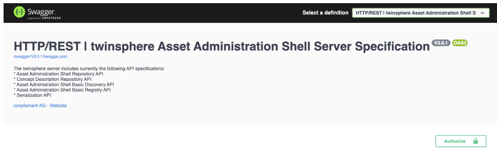

# twinsphere ID

twinsphere ID is the central identity management solution of the twinsphere platform. Using twinsphere ID
allows single sign-on for all the twinsphere applications, and is built on modern OAuth 2.0 / OIDC standards.

Both **user** (human) and **service accounts** (machine) accounts are supported.

## Users

### Registering

In order to obtain a new user in twinsphere ID, please contact our [support team](contact.md) and provide
an e-mail address for this user. You will receive an E-Mail invitation shorty.

### Usage

All our applications provide login functionality for users, in which you will be redirected to our
identity provider for login. Our APIs also provide a user-friendly interface based on the Swagger UI.

Simply use the *Authorize* button to log in (and use the last option on the bottom in the pop-up window).
Note that via *Authorize* you can also set access token directly, which might be useful in some testing
scenarios.



### Password reset

If you need to change your password, simply use the "forget password" function on the login screen.

## Service accounts

Service accounts can be created via the [Management API](management-overview.md).

### Usage

Service accounts user the common  [`client-credentials`](https://datatracker.ietf.org/doc/html/rfc6749#section-4.4)
OAuth 2.0 flow type, which means that you have to call a special endpoint to get an access token for the certain
application you are trying to access (also called *scope*).

Once you create your service account through [Management API](management-overview.md), you will get a list of
available scopes as well as the endpoint (`tokenUri`) where you can get your token(s).

<!-- markdownlint-disable line-length -->
```json
{
  "id": "27...26",
  "createdAt": "2025-10-01T12:01:01",
  "tokenUri": "https://twinsphere.ciamlogin.com/ag...25/oauth2/v2.0/token",
  "grantType": "client_credentials",
  "description": "To construct a proper requesting using this service account, refer to the twinsphere official documentation on https://docs.twinsphere.io",
    "scopes": [
    {
      "serviceName": "ManagementAPI",
      "scope": "api://...app/.default"
    },
    {
      "serviceName": "Tenant-A",
      "scope": "api://.../.default"
    },
    {
      "serviceName": "Tenant-B",
      "scope": "api://.../.default"
    }
  ]
}
```
<!-- markdownlint-enable line-length -->

> Consult the [Management API](management-overview.md) documentation on how to create secrets which are also required
for the `client_credentials` flow.
> Both client ID and client secret are confidential and should be kept secret!

#### Testing the tokens

Simplest way to receive a token using the credentials above would be to simply perform a cURL request:

```bash
curl --location --request POST 'https://twinsphere.ciamlogin.com/.../oauth2/v2.0/token' \
--form 'grant_type="client_credentials"' \
--form 'client_id="2c84bd-...-a437382"' \
--form 'client_secret="z~n8...Zn"' \
--form 'scope="api://twinsphere-server-...-api/.default"'
```

Response will be similar to:

```json
{
    "token_type":"Bearer",
    "expires_in":3599,
    "ext_expires_in":3599,
    "access_token":"eyJ0e...A"
}
```

The `access_token` field is the token you need to provide as an authorization header to every twinsphere API request,
formatted as `Authorization: Bearer eyJ0e...A`.

### Integration into your services

While cURL might be nice for testing purposes, in your real services you will need to use a HTTP or auth library you
have available in the programming language that you are using.

> ⚠️ **IMPORTANT:** Make sure to properly **cache the tokens**
and not request a new token with each twinsphere API request. Many standard libraries provide you this functionality
out of the box. **If you issue too many tokens, you might get rate limited!**
