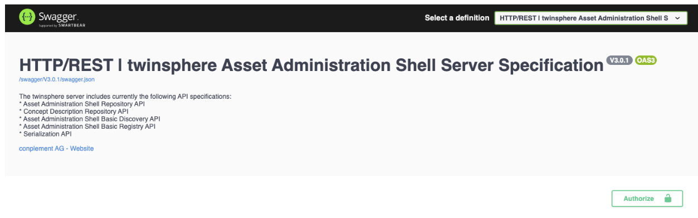

# Users

## Usage

All our applications provide login functionality for users, in which you will be redirected to our
identity provider for login. Our APIs also provide a user-friendly interface based on the Swagger UI.

Simply use the *Authorize* button to log in (and use the last option on the bottom in the pop-up window).
Note that via *Authorize* you can also set access token directly, which might be useful in some testing
scenarios.

## Password reset

If you need to change your password, simply use the "forget password" function on the login screen.