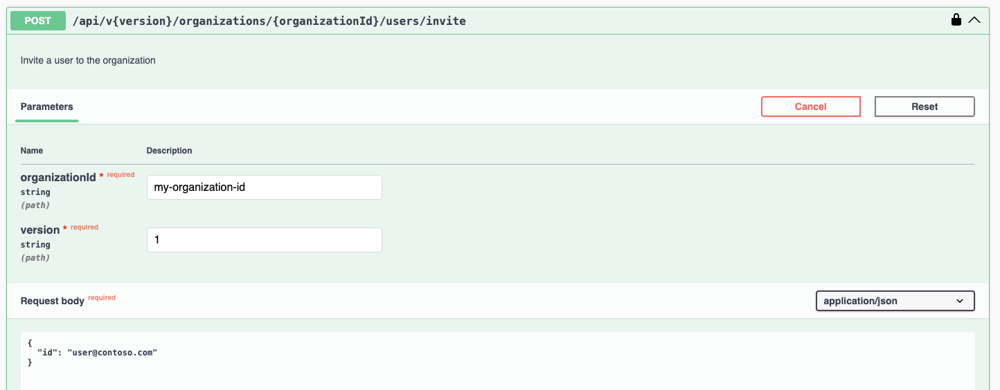
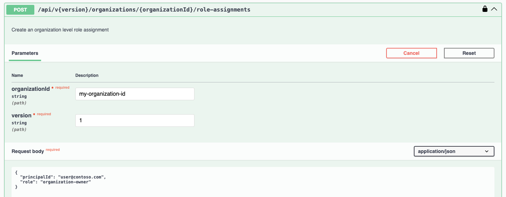
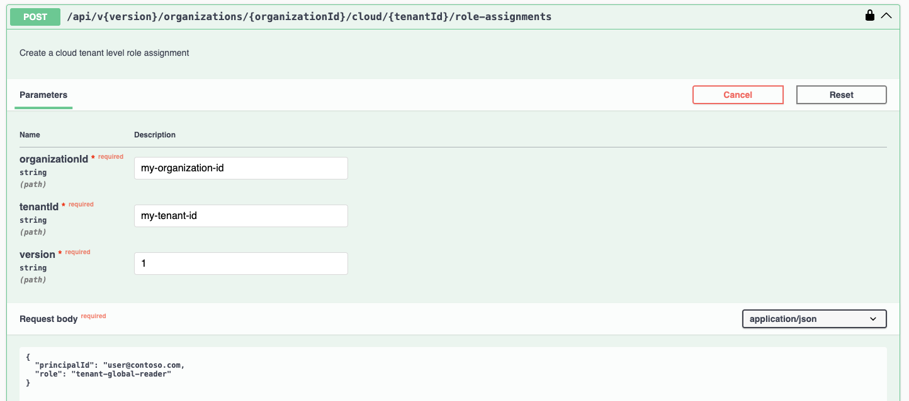
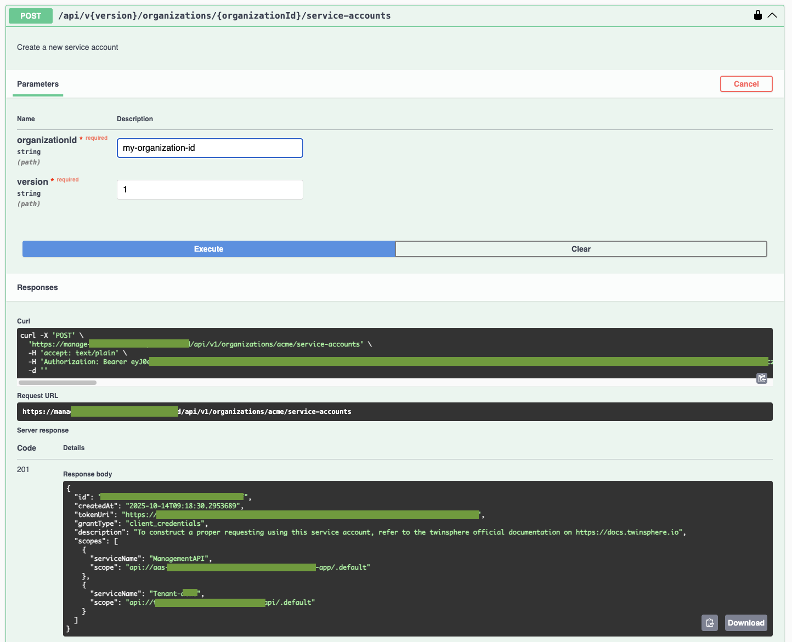
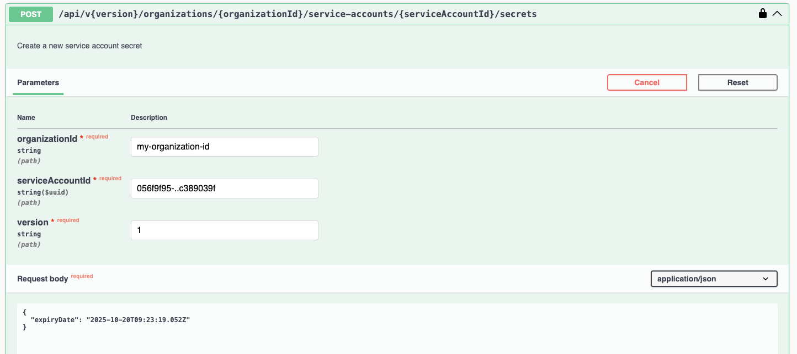

<!-- markdown-link-check-disable -->
# twinsphere Management API

The Management API enables secure automation of core RBAC, identity, tenant, user, and service account operations
within an organization. This API is designed for two audiences:

- twinsphere administrators who use the in-browser UI to manage their organization
- engineering teams integrating twinsphere capabilities into internal platforms, provisioning workflows
or infrastructure automation pipelines

## Getting Started

Important endpoints:

- the API itself is available under: [https://manage.twinsphere.io/api](https://manage.twinsphere.io/api)
- OpenAPI specification: [https://manage.twinsphere.io/openapi/v1.json](https://manage.twinsphere.io/openapi/v1.json)
- Swagger UI (browser-based): [https://manage.twinsphere.io/swagger/index.html](https://manage.twinsphere.io/swagger/index.html)

For each API request you need:

- the API version (currently only `v1`: [https://manage.twinsphere.io/api/v1](https://manage.twinsphere.io/api/v1))
- an authenticated principal (user or service account)
- your organization ID

Initially, each organization has a single user with rights to invite other users and create service accounts.

## Features

The Management API currently allows:

- user management within an organization
- service account management (including secrets)
- RBAC at organization and cloud (per cloud tenant) levels

## Authentication

1. Open the Management API Swagger UI in your browser: [https://manage.twinsphere.io/swagger/index.html](https://manage.twinsphere.io/swagger/index.html)
2. Use the Authorize (green) button on the right
3. Choose one of the available authentication methods:
    - Bearer: paste an existing bearer token (useful when testing service accounts)
    - OAuth2: authenticate using your twinsphere ID account

You can also call the API with any HTTP client (e.g., curl). Using the Swagger UI is optional.

## Inviting users

You can invite any user to your organization using their twinsphere ID.
If the user does not yet have one, please submit a [support ticket](contact.md).

> User self-registration in twinsphere ID is coming soon.

To invite a user, use: `POST /api/v{version}/organizations/{organizationId}/users/invite`

## Role-based access control (RBAC)

For any organization member (user) or any service account you created, you can create role assignments
to define their access. Roles can be assigned at:

- organization (global) level
- cloud level (per cloud tenant)

Organization-level roles implicitly grant access to all cloud tenants and should be limited
to administrators or super-users.

List available roles:

- `GET /api/v{version}/organizations/{organizationId}/roles`
- `GET /api/v{version}/organizations/{organizationId}/cloud/roles`

Assign the organization-owner role:

- `POST /api/v{version}/organizations/{organizationId}/role-assignments`

Assign a role for a single cloud tenant (e.g., read-only AAS data):

- `POST /api/v{version}/organizations/{organizationId}/cloud/{tenantId}/role-assignments`

## Service accounts

Service accounts provide headless (machine-to-machine) access.

Create a service account:
`POST /api/v{version}/organizations/{organizationId}/service-accounts`

Add a secret to a service account:
`POST /api/v{version}/organizations/{organizationId}/service-accounts/{serviceAccountId}/secrets`

> ⚠️ **IMPORTANT:** The secret value is shown only once at creation time.
> Store it securely immediately; you cannot retrieve it again later.
>
> ℹ️ **More about authentication:** To learn more about authentication flows,
> consult the detailed guide in [cloud-auth.md](cloud-auth.md).
<!-- markdown-link-check-enable -->
