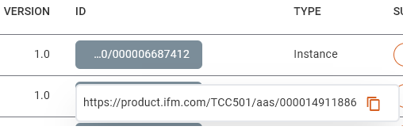
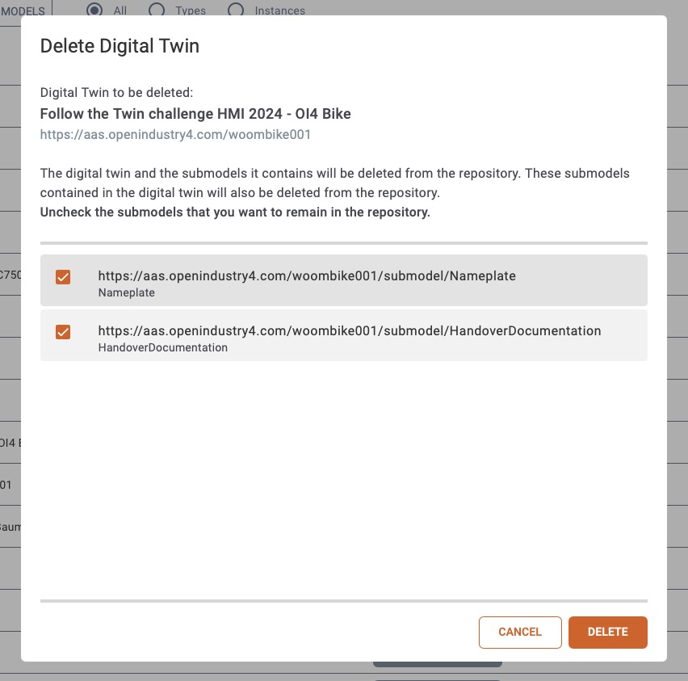
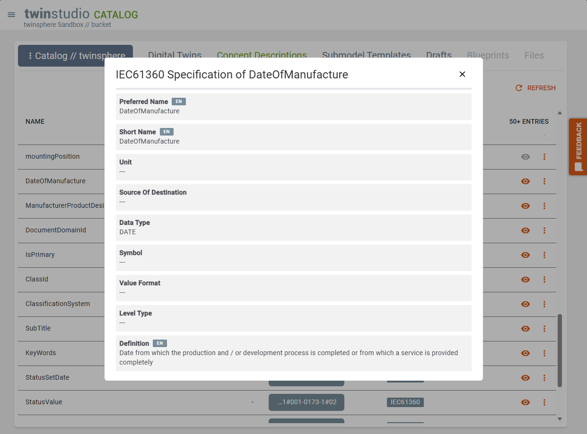
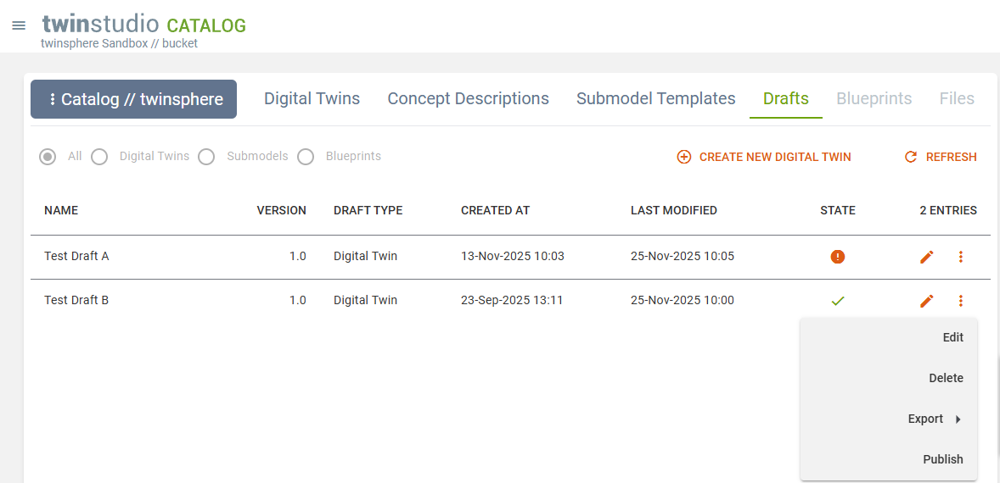
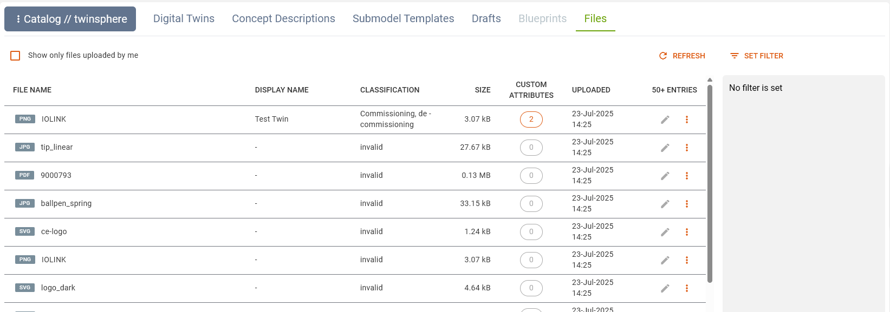
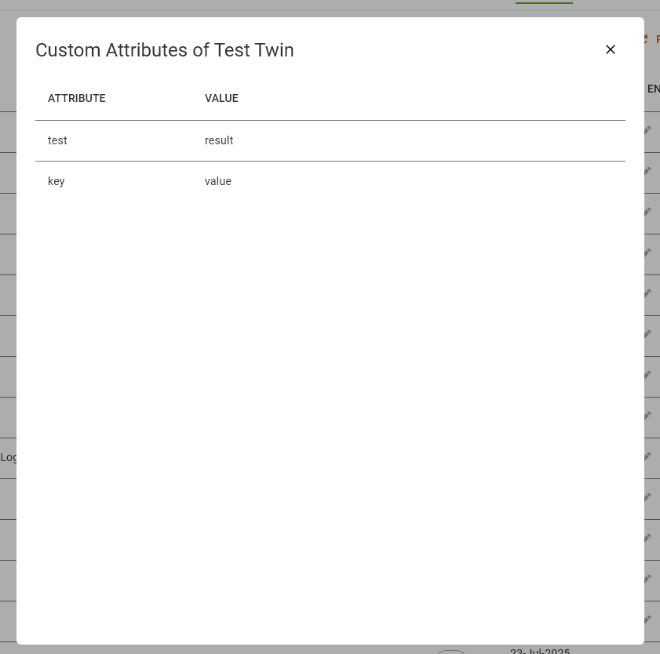
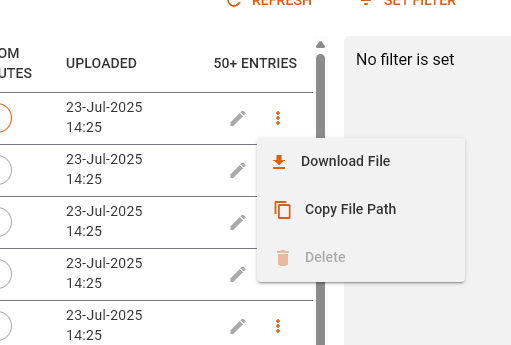

# twinstudio Catalog

## General Information

The catalog is a view on all the content of twinsphere like twins, submodel templates, concept description
and more.

Each object type has its own catalog. Its records are displayed as a list. On most items you may invoke actions, like
viewing or editing a twin or displaying the detailed definitions of a concept description.

If there are more entries than displayed (indicated by a *"+"* sign in the list header) a *load more* button is visible
at the bottom of the list. Each load will add up to 50 entries.

{: width='800'}

Every catalog has a *refresh* button which reloads the first 50 entries with the selected
filters if any are available and set.

Each **id** column contains a button that displays the shortened id.
On click the full id is shown and can be copied to your clipboard.

{: width='400'}

**Version** is only displayed if the version of the entry's administration is set,
else there is just a *"-"* visible.
If no revision is given it will be assumed as *0*.

## Catalog of Twins

The catalog of twins has a toggle on top to switch between *asset administration shells* and *submodels*.

### Asset Administration Shells

{: width='800'}

The **quick filter** at the top allows you to display only twins of the selected *asset kind* (types or instances).

On the right a **filter** for the shells can be set:

- Filters are combined with a logical AND, so twins have to fulfill all set filter criteria to be in the result list.
- Text filters are case-insensitive.
- A partially qualified value can be specified for all attributes listed as
  [regex supported filter properties](cloud-shell-filter-queries.md/#regex-support).

The **submodel column** shows the count of submodels the respective twin has. A click opens a dialog listing them
with some basic information.

The action represented by an **eye symbol** (or the "Show" button in the more menu) opens the twin in our
[twinsphere Viewer](viewer-overview.md) for viewing all of its data in detail.

The action represented by a **pen symbol** (or the "Edit" button in the more menu) opens the twin in our
[Twin Builder](studio-twin-builder.md) for editing.

{: width='350'}

The more menu offers two further features:

- The **export** of twins as JSON or XML to a file or directly to your system's clipboard.
- The **duplication** of *instance* twins (not types).
- The **deletion** of twins.

#### Delete Twin Dialog

After clicking on the **deletion** entry, a dialog appears. There you can see which twin will get deleted.
You also have the possibility to deselect certain submodels of the twin, if you do not want them to be deleted.
Submodels which are referenced by other twins, cannot be selected for deletion. If you want to delete a type twin,
you will get a warning about its implications.

{: width='350'}

#### Duplication of Instance Twins

When duplicating an existing twin all of its data (shell and referenced submodels) are duplicated. New IDs are created
and assigned to the copies. We highly recommend using the studio's
[ID Generator feature](studio-general-features.md/#id-generator) here. Otherwise, you'll be asked to enter an AAS-ID
and GlobalAssetID manually and we will use the aas-id value appended by "/sm/{ULID}" automatically for all new submodel
IDs.

### Submodels

{: width='800'}

The Submodels view of the Twin Catalog lists all existing submodels of the connected tenant.

The **export** of a submodel is available as action in the more menu of each record.

!!! Note
    The twin catalog of submodels is work in progress. There are more feature to come here.

## Catalog of Concept Descriptions

{: width='800'}

This catalog lists all concept descriptions available in the corresponding repository of your twinsphere tenant.

Since a concept description may consist of multiple data specifications the according catalog column shows which types
of specification are included in each record. Currently only the type *IEC61360* is recognized and displayed by name.
Every other specification will be labeled as "unknown". [Please give us a hint](contact.md#support-channels) if you
experience this value so we can improve our recognition here.

If it is an *IEC61360* data specification you can inspect the details of it by clicking on the *eye* button.

The **export** of a concept description is available as action in the more menu of each record.

*Preferred Name*, *Short Name* and *Definition* display an initial value from
the available languages according to following criteria:

1. the data language
2. containing the data language
3. the ui language
4. containing the ui language
5. english (en)
6. containing english (en)

You can select another language value by clicking on the corresponding language tag.
Hovering over a tag will display an indicator above it.
The selected language is highlighted with a gray background.

## Catalog of Submodel Templates

{: width='800'}

This catalog displays all *submodels* in your twinsphere repository that are of kind **template**.
These are the ones you can choose from when adding new submodel to your twin in
[Twin Builder](studio-twin-builder.md/#addremove-submodels).

The **export** of a submodel template is available as action in the more menu of each record.

## Catalog of Drafts

{: width='800'}

Your personal **twin drafts** are shown here.

They are sorted by the *last modified* column in descending order.
The state column shows if your draft has still issues (issue count as tooltip) or is valid already.

You may continue editing the twin draft by clicking on the **pen symbol** or choosing "**Edit**" in the more menu.
This is as well where you may "**Delete**" the draft or "**Export**" it.

For valid drafts only the more menu offers a "**Publish**" action. This will publish the twin to the connect
twinsphere tenant's repository and delete the draft afterward.

!!! note
    With introduction of the upcoming twinstudio modules **Template Designer** and **Blueprint Editor** further draft
    types will become available and shown in this catalog as well.

## Catalog of Files

In this catalog all *files* of the twinsphere are displayed. The classification value is displayed according to the
[Handover Documentation Submodel](https://industrialdigitaltwin.io/idta-submodel-templates/Handover%20Documentation/v2.0/index.html#_annex_b_how_does_the_submodel_handover_documentation_relates_to_the_submodel_intelligent_information_for_use).
Values that are not in this list will be displayed as *invalid* and empty values display *"-"*.
Filesize is shown as kilo byte value until it reaches 0.1 mega byte
then the MB unit is used up to the maximum size of 100 MB.

{:width='1000'}

The custom attributes column displays the count of attributes. If this is greater than 0 it gets clickable and
a dialog that displays all custom attributes is shown.

{:width='400'}

Each file has a menu with the following actions:
*download*, *copy file path* and in future iterations the option to *delete*.

{:width='400'}

*Set Filter* opens a dialog which allows to filter the file list.
The *Display Name* and *File Name* filter check for the inclusion of text ignoring casing.
The two date selects are for start and end date.
Start date the time 00:00:00 will be added and to the end date 23:59:59.
Added attributes will be matched exactly.
If either a key or a value is empty this pair will be ignored for filtering the files.

{:width='600'}
