# twinstudio Catalogue

## What the catalogue is

The catalogue shows everything stored in the twinsphere tenant you are connected to: digital twins, submodels,
concept descriptions, your own drafts and the files in the file repository. Each kind of content has its own page,
and each page has its own controls.

The catalogue pages share a common layout:

- A **toolbar** at the top with **Refresh**, the view switch, the number of entries and the actions available on that
  page. **Refresh** reloads the first page of entries using the filters you have set.
- The **filter rail** on the right. **Set filter** opens the filter dialog; the filter entries you have added are listed
  underneath and can be removed one by one.
- **Load more** at the bottom of the list, if more entries match than are currently shown. Each load adds up to 50
  entries. The count in the toolbar tells you whether it refers to your whole tenant (*50+ Entries in this tenant*) or
  to the current filter (*Entries matching the current filter*).

Every **ID** column contains a copy button. It shows a shortened ID; select it to see the full value, and use the copy
icon next to it to put it on your clipboard.

**Version** is only shown when the entry has a version in its administration. If it has none, a dash (*-*) is
displayed. A missing revision is treated as *0*.

## Catalogue of digital twins

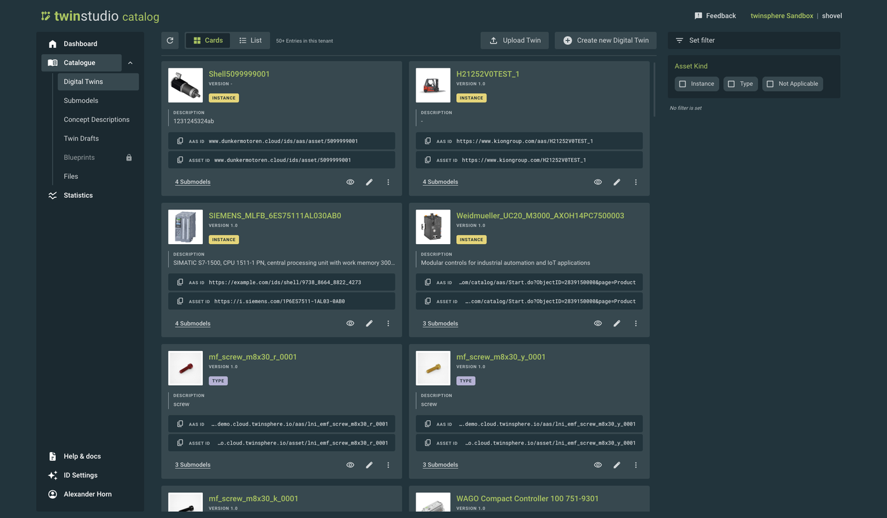

The twin catalogue is the main page of the catalogue. Switch between the **Cards** and **List** views with the buttons
in the toolbar. Both offer the same actions; only the presentation differs.

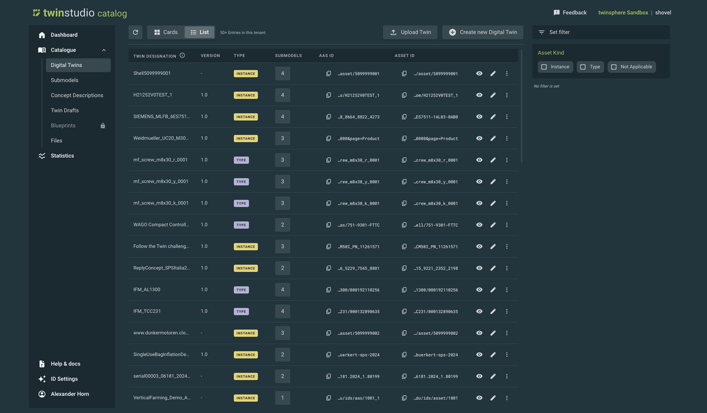

The twin designation in both views is a processed value, derived from the shell in this order: **displayName**,
**idShort**, **id**. A card additionally shows the description and the thumbnail of the twin, the asset kind
(**Instance**, **Type** or **Not Applicable**), both identifiers, and the number of submodels it contains. The list view
shows the same information in columns.

Select the submodel count to open a dialog listing the submodels of that twin with their basic details.

### Creating and importing twins

- **Create new Digital Twin** opens the [twin creation wizard](studio-twin-builder.md#twin-creation-wizard).
- **Upload Twin** opens a twin from an **AASX**, **JSON** or **XML** file, or from the clipboard. If the file contains
  more than one twin, you are asked which one you want. Submodels of type **template** are filtered out and the files
  they contain are ignored. Afterwards you are taken to the editor.

Both buttons are only available with the **Studio Creator** licence.

### Filtering twins

The **Asset Kind** facet in the filter rail is always visible and lets you narrow the list to instances, types, or
twins without an asset kind with a single click.

For anything else, select **Set filter** to open the filter dialog. It has three tabs:

| Tab | Filters |
|---|---|
| **Twin Data** | Asset kind, global asset ID and AAS ID |
| **Used Submodel Templates** | Twins that use a particular submodel template |
| **Nameplate Values** | Manufacturer name, designation, article number, serial number, year of construction |

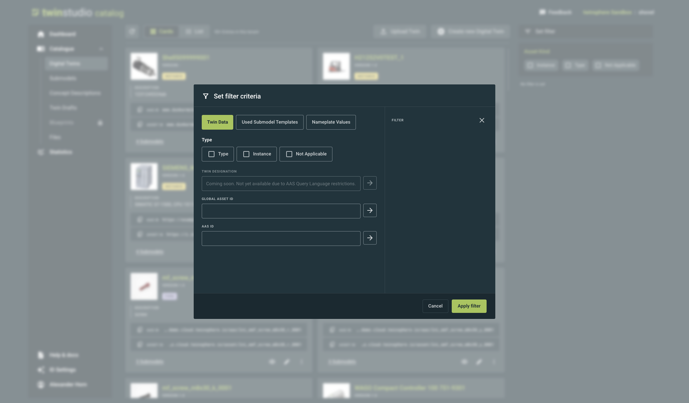

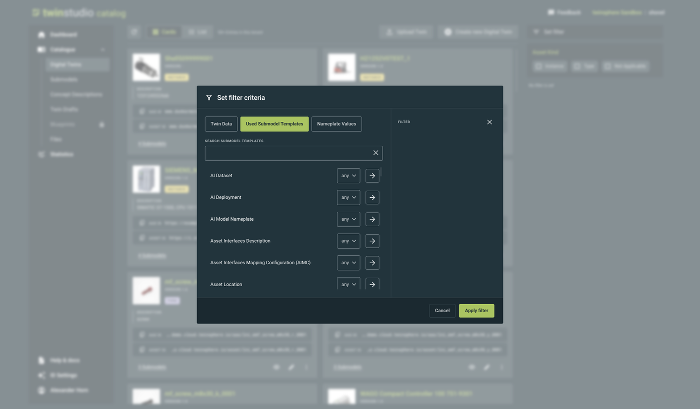

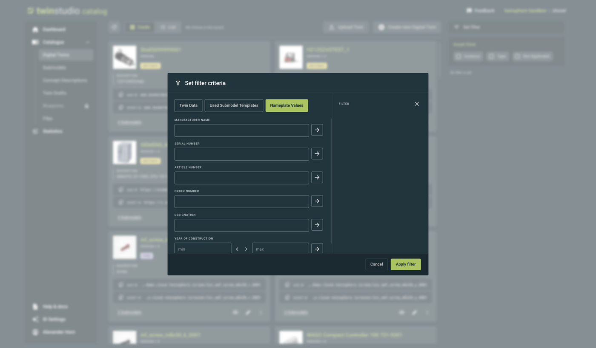{: width='1000' }

Each entry you add appears on the right-hand side of the dialog as you build it up. Entries of the same kind are
combined with *or*, and the three tabs are combined with *and*. Select **Apply filter** to apply the result, or
**Clear all** to start again.

Text filters find a match anywhere in the text, ignoring case. Year of construction is compared as a range, so
*min* and *max* narrow the result from both sides.

The **Twin Designation** filter is not available yet. It is disabled because the underlying AAS query language does not
support it at the moment.

### Actions on a single twin

The **more actions** menu on a card or a row offers:

| Action | What it does |
|---|---|
| **Show** | Opens the twin in the [twinsphere Viewer](viewer-overview.md) to inspect all of its data |
| **Edit** | Opens the twin in the [Twin Builder](studio-twin-builder.md) for editing |
| **Export** | Opens the export dialog (see below) |
| **Duplicate** | Creates a copy of the twin (see below) |
| **Delete** | Deletes the twin (see below) |

The eye and pencil icons on a card do the same as **Show** and **Edit**.

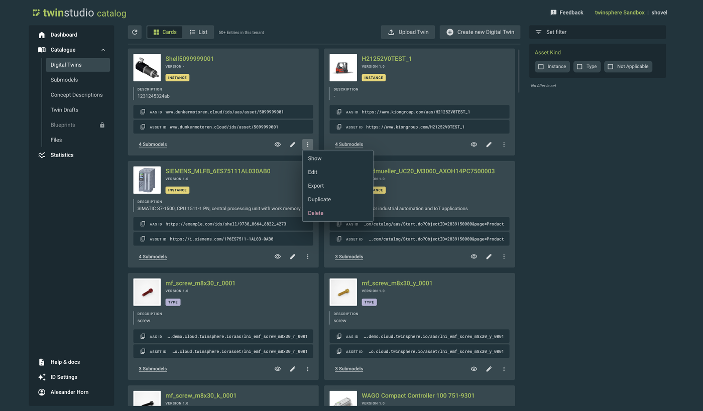{: width='900' }

### Exporting a twin

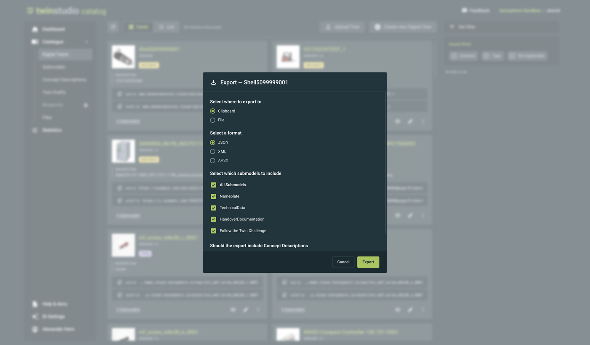{: width='900' }

The export dialog asks four things:

1. **Where to export to**: the clipboard, or a file download.
2. **The format**: JSON, XML or AASX.
3. **Which submodels to include.** *All Submodels* selects or clears the whole list at once.
4. **Whether the concept descriptions should be included**.

Two restrictions apply:

- **AASX** can only be selected when the target is **File**, and only for a twin that has been published and not changed
  since. Publish the twin first, or export it from the catalogue instead.
- Concept descriptions are only available for a twin that exists in the repository, because only then are they stored
  there.

### Duplicating a twin

**Duplicate** copies a twin with all of its data, including the referenced submodels. New identifiers are created for
the copy.

We recommend setting up the [ID generator](studio-general-features.md#id-settings) before duplicating. Without it you
are asked to enter an AAS ID and a global asset ID by hand, and every new submodel ID is derived automatically by
appending `/sm/{ULID}` to the AAS ID.

### Deleting a twin

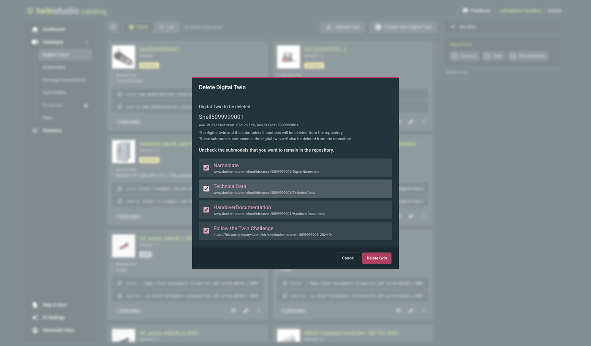{: width='1000' }

The delete dialog names the twin that will be removed and lists its submodels. Clear the checkbox of any submodel you
want to keep. Submodels that are referenced by other twins cannot be selected for deletion, because deleting them would
break those twins.

Deleting a twin of asset kind **Type** shows an additional warning about the consequences.

## Catalogue of submodels

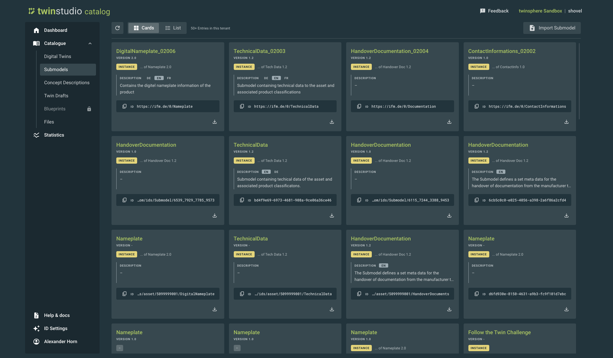

The submodel page lists every submodel and submodel template in the tenant. It offers the same **Cards** and **List**
views as the twin page.

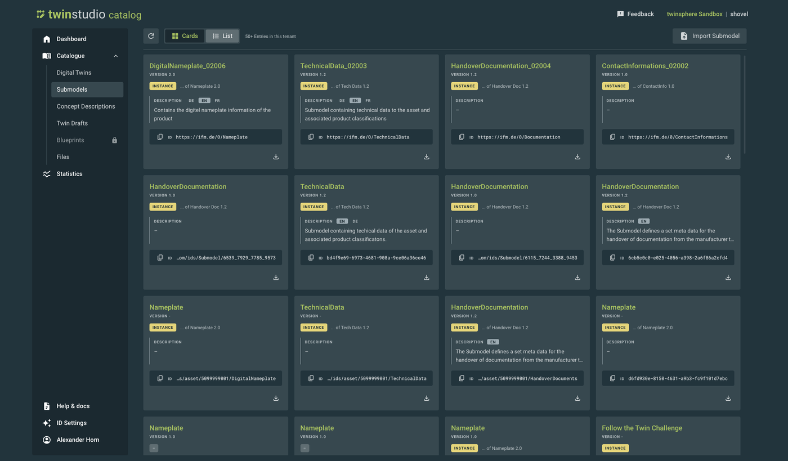

A submodel card shows the description with the languages it is available in, the submodel ID, the type of the submodel
(**Instance** or **Template**) and the template it is based on, if that template can be resolved. Submodels and
templates are listed together; the table shows the same information in columns.

### Importing a submodel

Select **Import Submodel** to add a submodel that was created elsewhere. You can drag a file onto the dialog or read the
submodel from the clipboard.

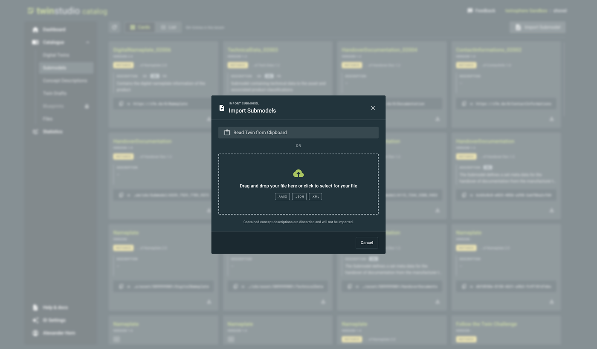{: width='1000' }

The submodel is validated before it is stored, and the problems found are shown to you first.

### Exporting a submodel

The **more actions** menu of a submodel or template opens the same export dialog as for twins, so you can choose the
format and the target.

!!! note
    The submodel catalogue is still being extended. More features are planned here.

## Catalogue of concept descriptions

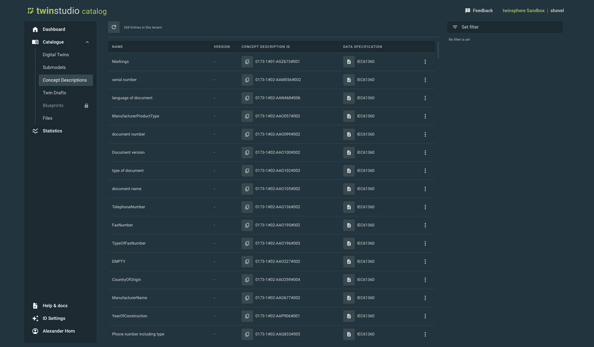

This page lists all concept descriptions in the repository of your twinsphere tenant. Concept descriptions are the
semantic definitions that the submodels in your tenant refer to.

The **Data Specification** column shows which kinds of specification a concept description contains. Only the type
*IEC61360* is recognised and shown by name; anything else is labelled *unknown*.
[Please tell us](contact.md#support-channels) if you come across such a value, so we can extend the recognition.

Select the specification chip to open the details of an *IEC61360* specification: preferred name, short name, unit,
source of definition, data type, symbol, value format, level type, definition and the embedded data specification.

The **more actions** menu offers **Export**.

A concept description can carry its names and definitions in several languages. The values that are shown use the
first available match in this order:

1. your preferred data language
2. a value containing your data language
3. your interface language
4. a value containing your interface language
5. English (`en`)
6. a value containing English

Select a language tag to switch to that language. The selected tag is highlighted.

## Catalogue of drafts

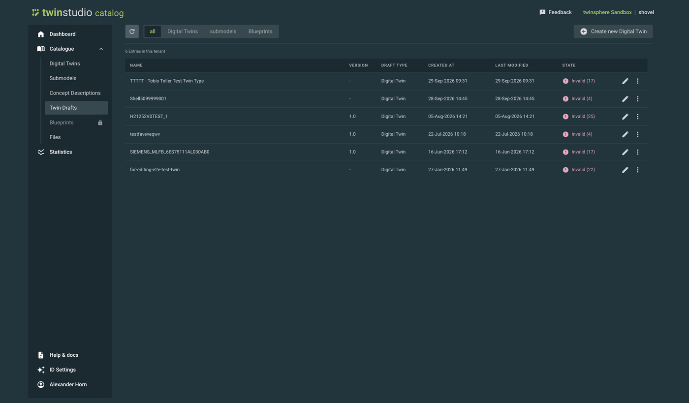

Your personal twin drafts are listed here, most recently modified first.

| Column | Meaning |
|---|---|
| **Name** | The name of the draft |
| **Version** | The version of the twin |
| **Draft Type** | Currently always a twin draft |
| **Created At** | When the draft was first saved |
| **Last Modified** | When the draft was last changed |
| **State** | **Valid**, or **Invalid** with the number of issues as a tooltip |

The **Draft Type** switch also offers **Submodels** and **Blueprints**, but those draft types do not exist yet, so only
twin drafts are listed today.

The **Edit** button continues work on a draft. The **more actions** menu additionally offers **Delete**, **Export**,
**Duplicate** and, for drafts without validation issues, **Publish**. Publishing transfers the twin to your twinsphere
tenant and removes the draft afterwards.

Editing, duplicating, publishing and deleting a draft require the **Studio Creator** licence.

Drafts are private to you. Nobody else can see or edit them.

## Catalogue of files

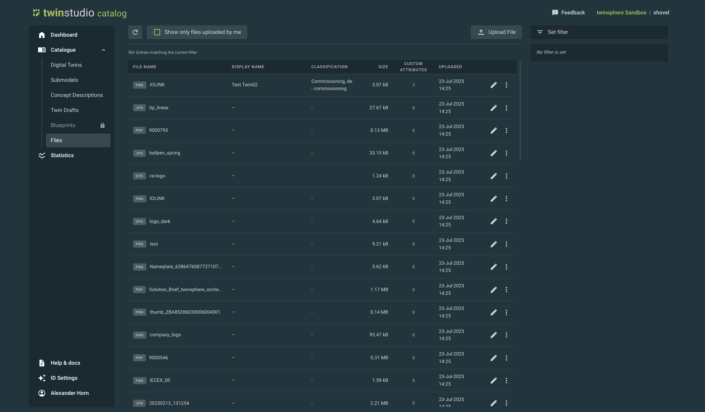

This page lists all files in the [twinsphere file repository](cloud-documentation.md#file-repository). Files are the
documents and images that can be attached to twins and submodels.

| Column | Meaning |
|---|---|
| **File Name** | The name in the repository, with a preview of the file type |
| **Display Name** | A descriptive name you can set yourself |
| **Classification** | The document classification according to VDI 2770 sheet 1:2020 |
| **Size** | The size of the file. Values are shown in kB below 100 kB and in MB above that |
| **Custom Attributes** | How many custom attributes are set. Select the number to display them all |
| **Uploaded** | When the file was stored |

**Show only files uploaded by me** narrows the list to your own uploads.

Classification values that are not part of the VDI 2770 list are shown as *invalid*. An empty value is shown as a dash
(*-*).

### Custom attributes

Select the number in the **Custom Attributes** column to see all attributes of a file in a dialog. The **Edit** button
there opens the [properties dialog](#editing-file-properties) directly.

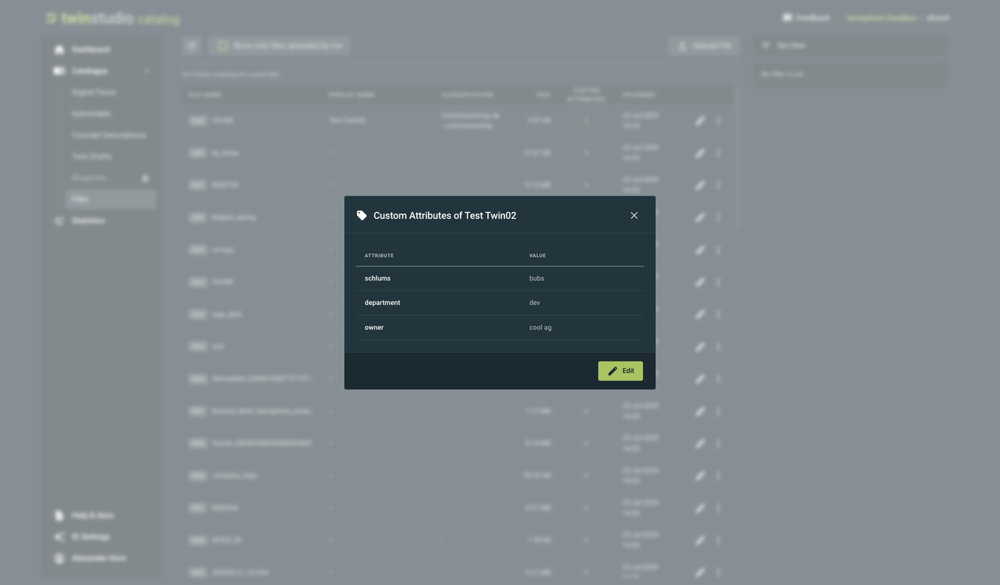{: width='1000' }

### Actions on a single file

Each row has an **Edit Properties** button and a **more actions** menu:

| Action | What it does |
|---|---|
| **Download File** | Downloads the file |
| **Copy File Path** | Copies the twinsphere file path to your clipboard, for use in a *File* element |
| **Edit Properties** | Opens the properties dialog (see below) |
| **Delete** | Not available yet. Offered once file references can be checked before deletion |

### Uploading a file

Select **Upload File** in the toolbar to open the upload dialog.

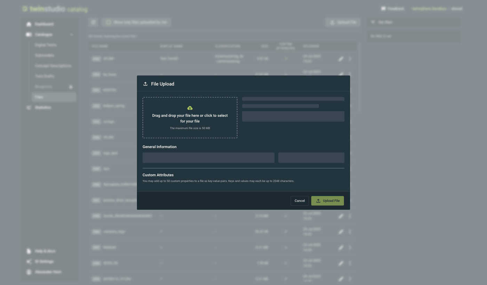{: width='1000' }

Drag your file onto the drop area, or select it from a file dialog. The maximum file size is 50 MB.

You can then set:

- **Twinsphere File Name** without a file extension, if you want a different name in the repository.
- **Display Name**, independent of the file name, to make the file easier to recognise.
- **Document Classification** according to VDI 2770.
- **Custom attributes**, up to 50 key and value pairs. Keys and values may each be up to 2048 characters long.

All criteria are combined with *and*, so a file has to match every one of them. Custom attributes are matched exactly.
If a key or a value is left empty, that pair is ignored.

Custom attributes are free-form. A common pattern is a key such as `type` with a value such as `logo`, which later
makes it easy to find every logo with the file filter.

### Editing file properties

Select **Edit Properties** in a row to change the display name, the classification and the custom attributes.

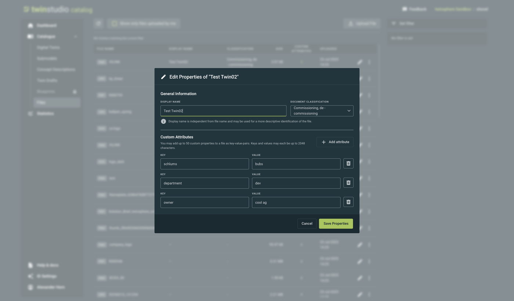{: width='1000' }

Every custom attribute needs both a key and a value, or it has to be removed completely. Keys must be unique. If **Save
Properties** stays disabled, one of those rules has been broken.

### Filtering files

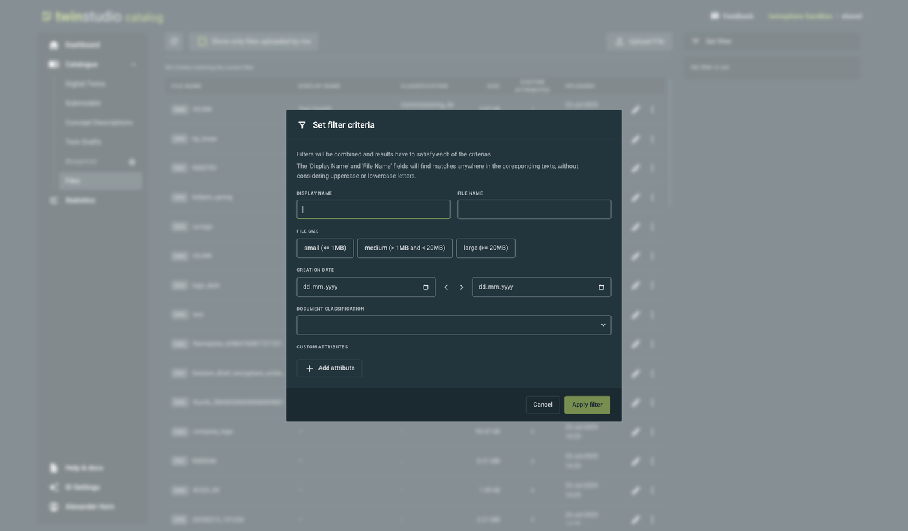{: width='1000' }

The file filter dialog offers:

- **Display Name** and **File Name**, which find a match anywhere in the text, ignoring case.
- **File Size**.
- **Creation Date**, as a start and an end date. The start date is read as 00:00:00 and the end date as 23:59:59.
- **Document Classification**.
- **Custom attributes**. Add as many key and value pairs as you need.
