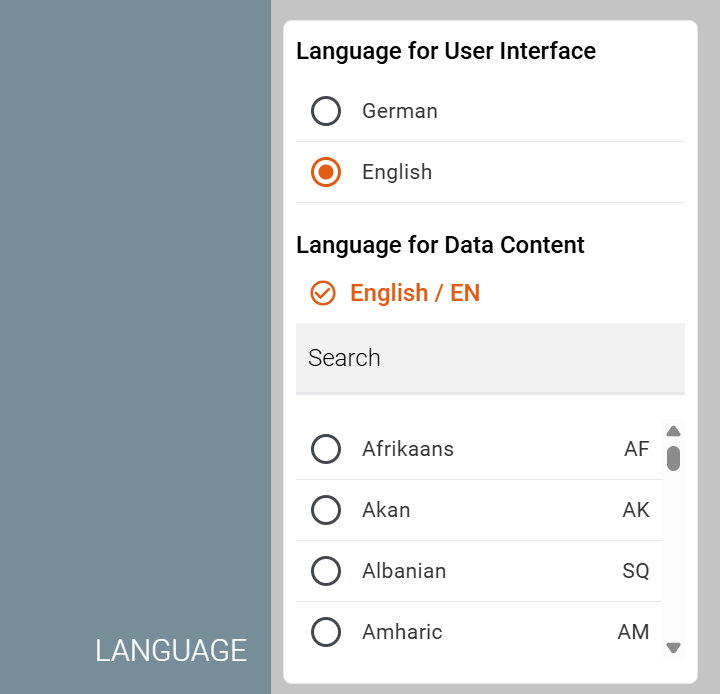
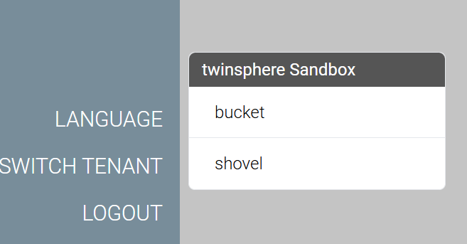
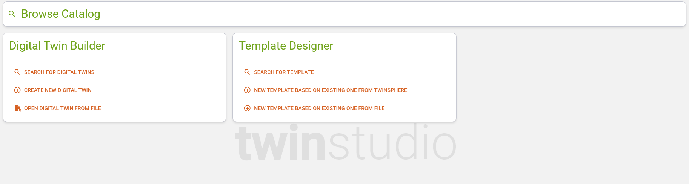

# twinstudio General Features

## ID Generator

You can specify generator patterns for several ID types:

- Global Asset ID
- Shell/AAS ID (aka Twin ID)
- Submodel ID

{: width='600' }

If set respective IDs are automatically generated when needed (mainly on twin and submodel creation) and
twinstudio will not ask you to manually fill-in IDs anymore.

!!!note "ID patterns have tenant scope"
    The ID generator patterns are applied at the tenant level, not just to your user account.  
    They are centrally stored in twinstudio. So other users will automatically create IDs according to the specified
    pattern when they are logged in to the relevant tenant.

## Language Settings

twinstudio supports the following languages for its user interface:

- German
- English

Furthermore you may set a preferred languages to represent the data content of your twins.

{: width='400' }

All language settings have user scope and are stored locally in your browser.

## Tenant Switch

twinstudio can connect to different twinsphere cloud tenants (access rights required).  
The tenants are hereby grouped into organizations. You can switch the tenant in the menu.

{: width='400' }

twinstudio remembers (locally in the browser) the last tenant you logged in with and automatically uses this for your
next session.

## Dashboard

The dashboard of twinstudio serves as an entry point to the application.
You can easily switch to the twin catalog or to any other module of the application.

{: width='500' }

## Object Naming

The AAS metamodel offers various options for selecting a display name for its objects. All of these options are
optional data fragments, i.e., it cannot be assumed that an object to be displayed actually has the desired
information. Many of the options are also language-dependent, and it is uncertain whether data records are actually
maintained for certain languages.

For twinstudio — or any user interface in this sense — a certain hierarchy of fallbacks is required to determine the
best option for naming the respective object. This is the only way to ensure, regardless of data quality, that a
object name is available at all, which ideally enables the user to recognize what they are dealing with.

In twinstudio the same object naming logic applies to the following AAS metamodel objects:

- shells
- concept descriptions
- submodels
- submodel elements

The name of those objects is determined in the following order (first available value wins):

- Object's property *displayName*, language value in the following order: 
    - studio's language setting "preferred data language"
    - studio's language setting "UI language"
    - language "EN"
- list index (only if object is a list element of a submodel list)
- Object's property *idShort*
- Object's property *id*
- Object's Propropertyperty *displayName*, first existing value (can be of any language)
- "Unknown Property" / "Unbekannte Eigenschaft"

Explanation:

- The *displayName* is the preferred value for each object.
    - Since this is data from the twin, we first use the data language selected by the user.
    - The user interface language comes second, as the user obviously understands this as well.
    - The last resort is EN, which is neither the data language nor the user interface language of the user, but is
      nevertheless generally understood.
- A submodel list item must not have an *idShort* (specification v3.0) and, as an SME, it also has no *id*.
  Therefore, we use its list index as the name if no *displayName* is available.
- For all other objects, an *idShort* is recommended, although this is not mandatory. Even though it is a technical
  property, its value is in English in most cases and has semantic meaning. Therefore, we also consider it as a name.
- Shells, submodels, and concept descriptions must have an *id*, so we use this as the last resort for these objects.
- However, this does not apply to SMEs, as they do not have an *id*. The last option for SMEs is therefore any other
  existing *displayName* value other than those mentioned above.
- If none of these work, we use a constant for naming SMEs as a last resort.

!!! note
    Concept Description are not yet used by twinstudio for the time being.  
    It is planned tough to take them into consideration for determination of an object's display name as well (e.g.
    *preferredName* of the data specification).

## Drafts

twinstudio is able to save your unfinished work as a so called *draft*.  
These *drafts* belong exclusively to the user who saved them. They cannot be accessed by anyone else.  
*Drafts* are stored in twinstudio and not in your twinsphere tenant/repository. Therefore, they may not yet be fully
valid and may still contain validation errors.

## Feedback

Feel free to provide feedback to the application so we can continuously improve your experience
and add features that matter most to you.
You can open the feedback form on the right of the screen.

{: width='400' }
