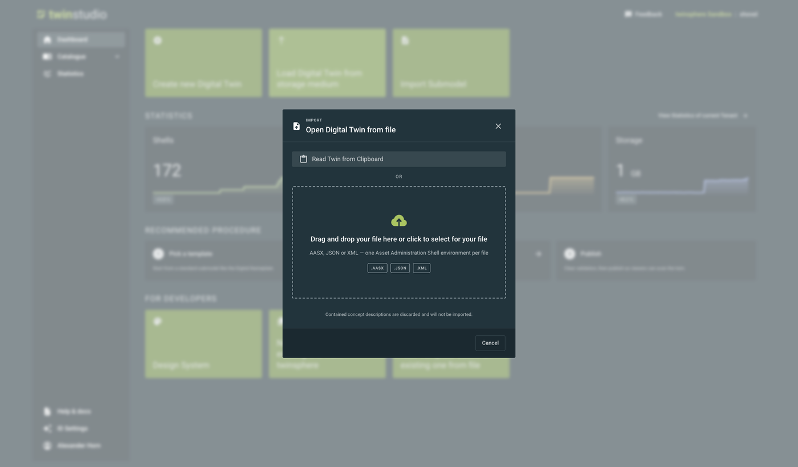
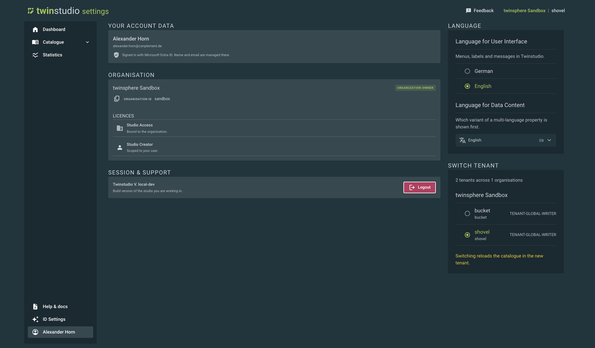
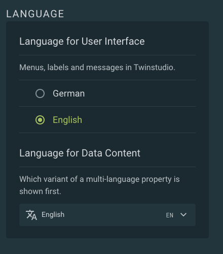
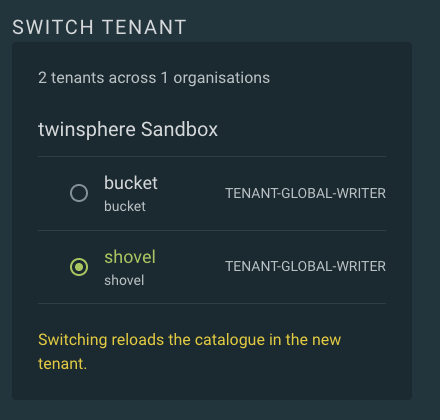
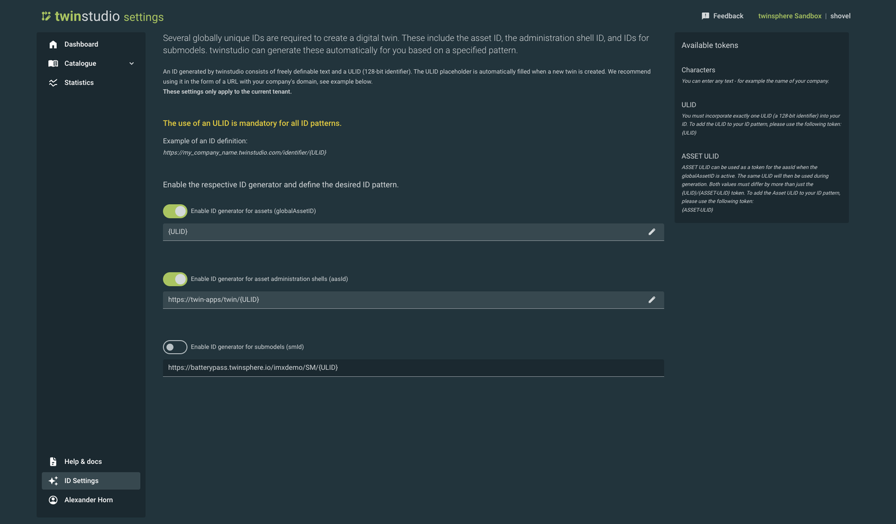
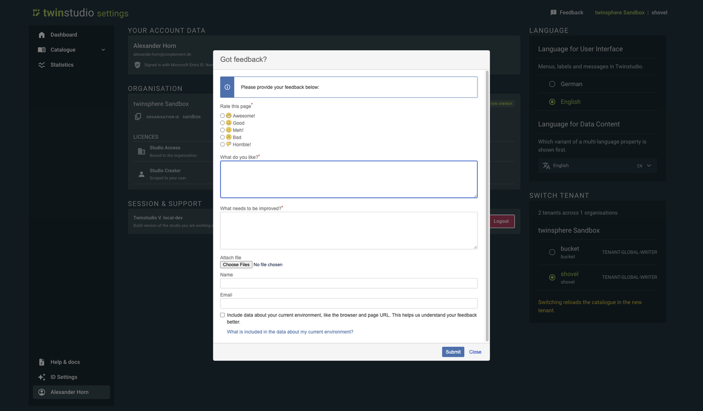

# twinstudio General Features

## The main menu

The menu on the left is always available and contains three entries:

| Entry | What it does |
|---|---|
| **Dashboard** | Your starting point. Create a twin, import a submodel, and see your tenant's key figures. |
| **Catalogue** | Everything stored in your tenant: digital twins, submodels, concept descriptions, drafts and files. |
| **Statistics** | How your tenant has grown over time. |

Below the menu you find **Help & docs** (opens this documentation), **ID Settings** and your user name. Selecting your
user name opens your [profile](#user-settings).

In the top right corner the current organisation and tenant are shown (here: `twinsphere Sandbox | shovel`), next to the
**Feedback** button.

## Dashboard

The dashboard is the entry point to the application. It offers the actions most users need first, a summary of your
tenant and a suggested workflow.

### Quick actions

- **Create new Digital Twin** opens the [twin creation wizard](studio-twin-builder.md#twin-creation-wizard).
- **Load Digital Twin from storage medium** opens a twin from an **AASX**, **JSON** or **XML** file, or from the
  clipboard. One Asset Administration Shell environment per file.
- **Import Submodel** adds a submodel from a file or the clipboard to your catalogue. The submodel is validated first,
  and any problems found are shown to you before anything is stored.

{: width='700' }

### Key figures

The dashboard shows the same figures as the [statistics](studio-statistics.md) page for the last week: the number of
shells, submodels, files and the storage used, each with the change over that period. Select **View Statistics of
current Tenant** to open the full statistics page.

### Recommended procedure

A short reminder of the usual path through twinstudio: pick a template, fill the fields, publish. Each step links to the
place where it is done.

## User settings

Select your user name in the main menu to open your profile. Everything that belongs to you personally is set here.

### Account data

Your name, e-mail address and how you signed in. With Microsoft Entra ID only the name and e-mail address are stored in
twinstudio.

### Organisation and licences

The organisation you are working in, its ID, and the licences that apply to you. **Studio Access** is bound to the
organisation, **Studio Creator** to your user account. The licence list tells you which features you may use.

### Session and support

The version of twinstudio you are working with, and the **Logout** button.

### Language

twinstudio supports **German** and **English** as user interface languages.

**Language for Data Content** is separate from the interface language. It decides which variant of a multi-language
value is shown first, for example in a nameplate or a description. Setting it to English means an English text is
preferred wherever one exists, even if you read the interface in German.

All language settings belong to your user account and are stored locally in your browser.

### Tenant switch

twinstudio can connect to several twinsphere cloud tenants, as long as you have access rights to them. Tenants are
grouped by organisation. Select a tenant to load its content.

The tenant you used last is remembered in your browser and used again the next time you sign in.

## ID Settings

Creating a digital twin needs several globally unique identifiers: one for the asset, one for the administration shell,
and one for each submodel. twinstudio can generate them for you from a pattern you define.

{: width='900' }

There is a separate switch and pattern for each of the three ID types:

- **assets** (globalAssetId)
- **asset administration shells** (aasId)
- **submodels** (smId)

Switch a generator on and enter a pattern such as `https://my-company-name.twinstudio.com/identifier/{ULID}`. Whenever
an ID of that type is needed, twinstudio fills it in and no longer asks you for it.

Every pattern must contain the `{ULID}` token exactly once. A ULID is a 128-bit identifier and is generated freshly each
time. We recommend wrapping it in a URL built from your own domain, so the ID stays unique and readable.

If the **asset** generator is active, the **aasId** pattern may use `{ASSET-ULID}` instead of `{ULID}`. The twin then
gets the same identifier for both, with the difference that both values stay distinct strings.

The **Available tokens** panel on the right lists the tokens you may use and what they mean.

!!! note "ID patterns have tenant scope"
    ID patterns are stored centrally in twinstudio and apply to the whole tenant, not only to your user account. Every
    user creating a twin in that tenant gets IDs according to the same pattern.

## Drafts

Unfinished work can be saved as a **draft**. Drafts belong to the user who saved them, are not visible to anyone else,
and are stored in twinstudio rather than in your twinsphere tenant. A draft may therefore still be incomplete and
contain validation errors.

Drafts are listed in the [draft catalogue](studio-catalog.md#catalogue-of-drafts), where you can continue editing,
export, duplicate, publish or delete them.

Starting with version 0.11, files that belong to a draft are stored with the draft, including their metadata and a
thumbnail. They are uploaded to your twinsphere tenant only when the twin is published.

## How objects are named

The AAS metamodel offers several ways to give an object a display name, and all of them are optional. A submodel may
carry names in one language but not another, and a name may be missing altogether. To make sure something readable is
always shown, twinstudio follows a fixed order and takes the first value that exists.

This applies to shells, concept descriptions, submodels and submodel elements. The order is:

1. The object's **displayName** in your preferred data language.
2. The **displayName** in your interface language.
3. The **displayName** in English (`en`).
4. The **list index**, if the object is a list element of a submodel list.
5. The object's **idShort**.
6. The object's **id**.
7. Any other **displayName** value, in whichever language it exists.
8. A generic placeholder such as *Unknown Property*.

A few details explain the order:

- **displayName** comes first because it is data from the twin, written for a reader.
- A submodel list element must not have an `idShort` (specification v3.0) and, as a submodel element, has no `id`
  either. Its position in the list is used instead.
- **idShort** is technical, but it is usually written in English and carries meaning, so it is preferred over the raw
  **id**.
- Shells, submodels and concept descriptions must have an `id`, which makes it a reliable last resort. Submodel elements
  do not, so for them any remaining **displayName** is used before the placeholder.

!!! note
    Concept descriptions are not yet used to name objects. It is planned to consider them as well, for example the
    *preferredName* of their data specification.

## Feedback

You can send us feedback at any time with the **Feedback** button in the top right corner. Tell us what you like and
what should be improved, and optionally attach a file.

{: width='700' }

There is also a checkbox to include technical data about your current environment, such as your browser and the page
URL. This helps us reproduce problems, and it is the only technical data sent unless you tick the box.
