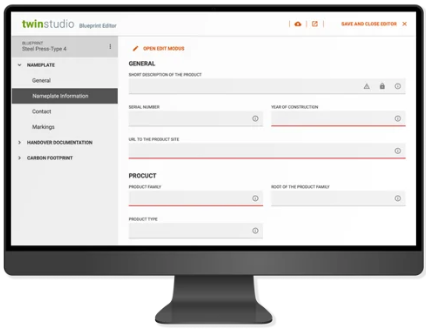

# twinstudio

twinstudio is a component of our twinsphere suite aiming at managing repository content (AASs, SMs, CDs, Files...)
and their manual editing.

It is available since October 2025 for beta testing to selected customers.  
See [release notes](studio-release-notes.md) for its already available feature set - but be aware:
there is so much more to come!

For more information please visit our [twinsphere landing page](https://www.conplement.de/en/twinsphere).

{: width='400' }
