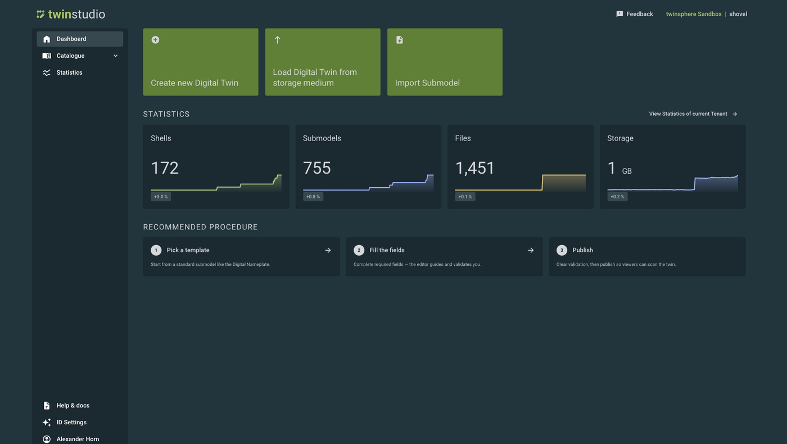

# twinstudio

twinstudio is the editor of the twinsphere suite. It is a web application for creating, editing and organising the
content of your twinsphere tenant: digital twins, submodels, concept descriptions and files.

Nothing has to be installed. You sign in with your twinsphere ID in a browser.

## What you can do with it

- **Create a digital twin** from scratch, by duplicating an existing one, or from a type twin.
- **Fill in its data.** twinstudio guides you through the submodel templates and checks your entries against the
  AAS metamodel while you work.
- **Publish it** to your twinsphere tenant, where the Viewer and the API can use it.
- **Organise your content.** The catalogue lists twins, submodels, concept descriptions, drafts and files, and lets
  you filter, export, duplicate and delete them.
- **Watch your usage.** The statistics page shows how your data has grown over time.

## Where to go next

| I want to … | Read |
|---|---|
| Create and edit a digital twin | [Twin Builder](studio-twin-builder.md) |
| Find, export or delete content | [Catalogue](studio-catalog.md) |
| Change my language, switch tenant, or set up ID patterns | [General features](studio-general-features.md) |
| See how my tenant has grown | [Statistics](studio-statistics.md) |
| Know what changed in which version | [Release notes](studio-release-notes.md) |

For more information about the twinsphere suite, visit our
[twinsphere landing page](https://www.conplement.de/en/twinsphere).
