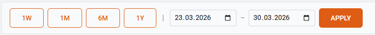
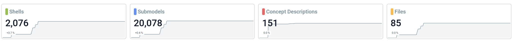
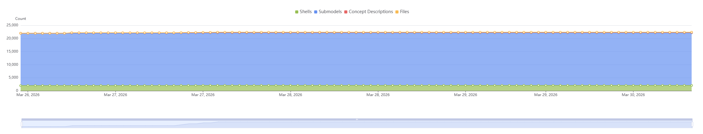
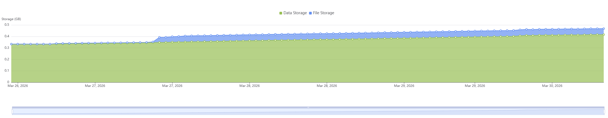
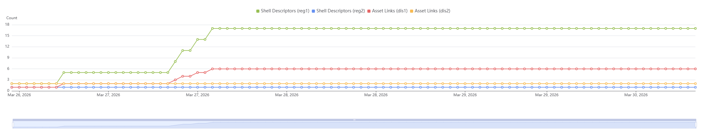

# twinstudio Statistics

The **Statistics** page gives you an overview of your tenant's current state and historical development.
You can monitor how your twin data, storage usage, and lookup data evolve over time — all in one place.

---

## Time Range Selection

At the top of the page you can select the time period you want to analyze.

### Quick Presets

Four preset buttons let you quickly switch between common time ranges:

- **7 days** – Last 7 days
- **28 days** – Last 28 days
- **6 months** – Last 180 days
- **1 year** – Last 365 days

The active preset is highlighted. Clicking a preset immediately loads the corresponding data.

### Custom Date Range

You can also define a custom time range using the *From* and *To* date inputs. After entering your
dates, click **Apply** to load the data.

!!! note "Time range limits"
    The *From* date must be before the *To* date. The maximum supported range is **5 years**.

---

## Key Performance Indicators

Below the time range controls, KPI cards give you a quick snapshot of your tenant's current state.

Each card shows:

- The **current value** of the metric
- A **trend indicator** showing the percentage change compared to the start of the selected period
  (↑ green = increase, ↓ red = decrease)
- A **sparkline** — a small background chart visualizing the metric's trend over the selected period

{: width='800' }

### Twin Data

| Metric | Description |
|--------|-------------|
| **Shells** | Number of Asset Administration Shells in the repository |
| **Submodels** | Number of Submodels in the repository |
| **Concept Descriptions** | Number of Concept Descriptions in the repository |
| **Files** | Number of files stored in the file repository |

!!! note "Monitoring objects"
    In each twinsphere tenant exist one shell and one submodel for operational monitoring purposes. You are not able
    to access them via API but they are included in the numbers of the tenant statistics.

### Storage

| Metric | Unit | Description |
|--------|------|-------------|
| **DB Storage** | GB | Current database storage consumption |
| **Blob Storage** | GB | Current blob (file) storage consumption |
| **Average File Size** | MB | Average size of stored files (no trend indicator) |

### Lookup Data

This section displays metrics for your Discovery and Registry instances.

!!! note "Conditional section"
    The Lookup Data section is only visible if your tenant has at least one Registry or Discovery
    instance configured. Each instance gets its own KPI card.

| Metric | Description |
| ------ | ----------- |
| **Shell Descriptors** *(per Registry instance)* | Number of shell descriptors registered |
| **Asset Links** *(per Discovery instance)* | Number of asset links registered |

---

## Charts

Three interactive charts visualize how your metrics have developed over the selected time period.

You can customize each chart:

- **Toggle series**: Use the checkboxes next to each series name to show or hide individual metrics
- **Zoom**: Use the slider at the bottom of the chart or your mouse wheel to zoom into a specific
  time range
- **Pan**: Click and drag to move through the timeline
- **Hover tooltip**: Hover over the chart to see exact values for all series at a given point in time

!!! note "Automatic granularity"
    The data resolution is chosen automatically based on your selected time range:

| Time Range | Data Granularity |
| ---------- | ---------------- |
| Up to 7 days | Hourly |
| Up to 30 days | Every 6 hours |
| Up to 1 year | Daily |
| Over 1 year (up to 5 years) | Weekly |

### Twin Development

Shows how the counts of your twin data objects change over time.

Available series (all enabled by default):

- Shells
- Submodels
- Concept Descriptions
- Files

{: width='800' }

### Storage Development

Shows how your storage consumption evolves over time.

Available series (all enabled by default):

- DB Storage
- Blob Storage

{: width='800' }

### Lookup Data Development

Shows how the number of shell descriptors and asset links changes over time across your instances.

!!! note "Conditional chart"
    This chart is only displayed if your tenant has at least one Registry or Discovery instance.
    If more than four instances are available, only the first four are pre-selected on initial load.

{: width='800' }

---

## Export

You can export the entire Statistics page — including all KPI cards and charts — as a PNG image
by clicking the **Download** button in the top-right corner.

The exported file is named: `stats-{tenantId}-{date}.png`
