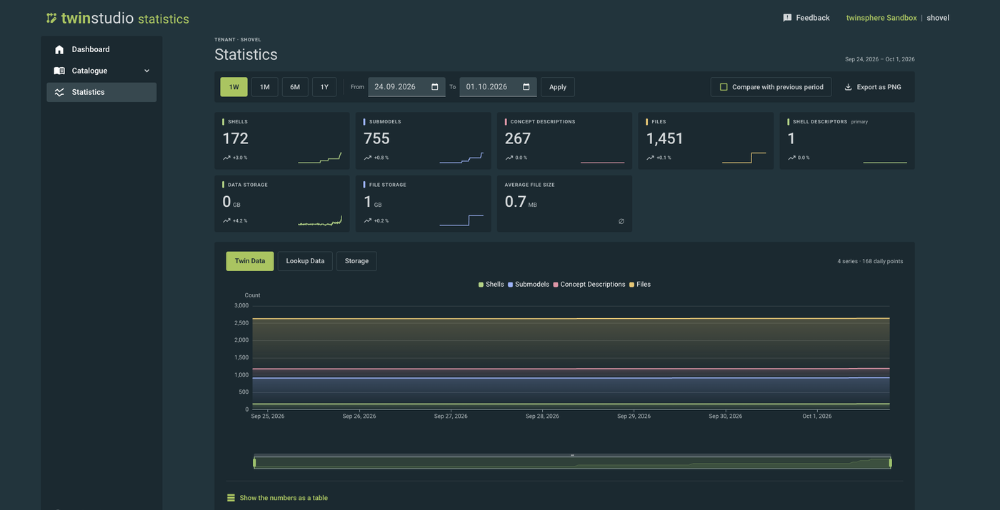
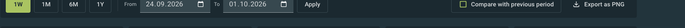
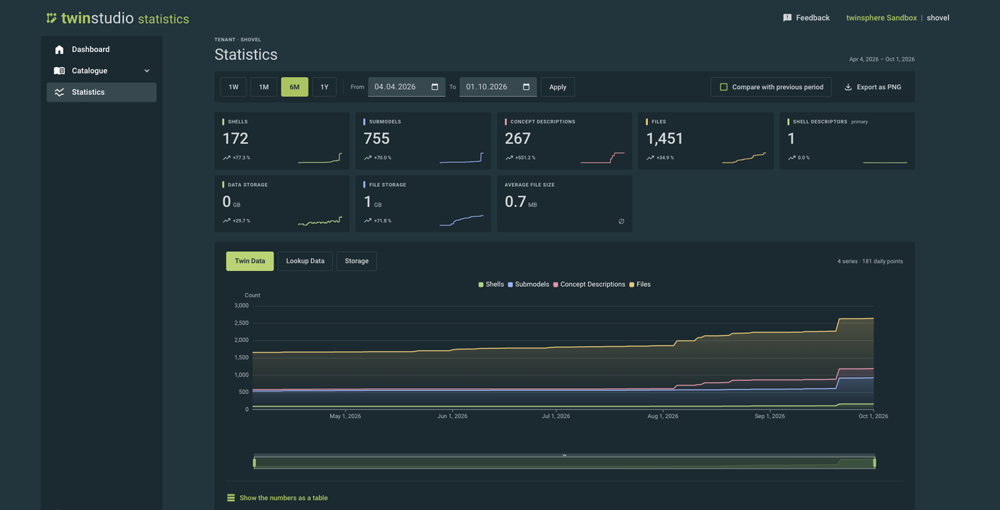
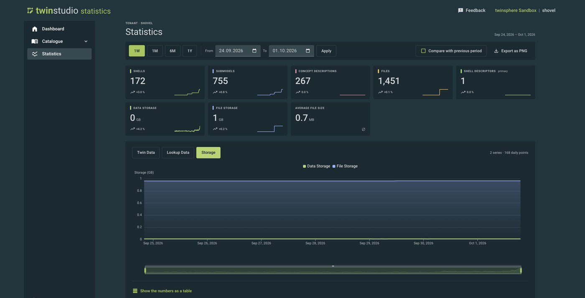
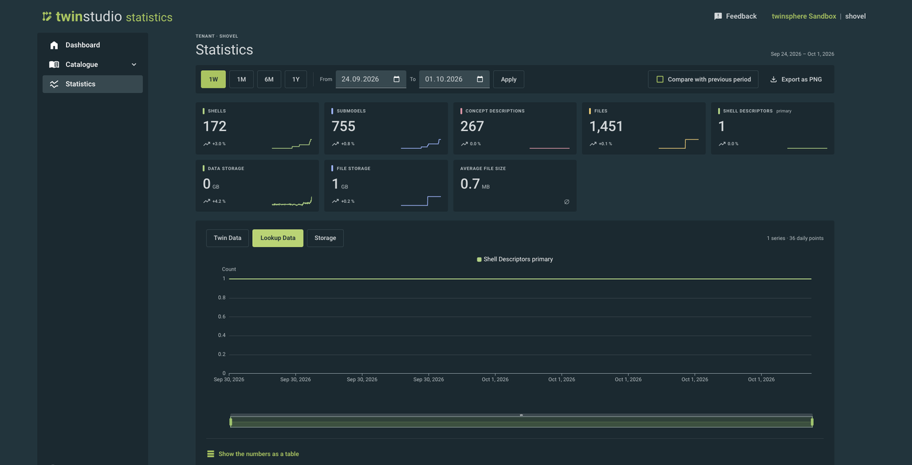

# twinstudio Statistics

The **Statistics** page shows the current state of your tenant and how it has developed over time. It answers
questions such as how many twins you have, how much storage they use, and how fast that has grown.

Open it from the main menu, or from **View Statistics of current Tenant** on the [dashboard](studio-general-features.md#dashboard).

## Selecting the time range

The range controls at the top decide which period the figures and charts cover.

{: width='1000' }

### Quick ranges

Four buttons cover the ranges most people need:

| Button | Period |
|---|---|
| **1W** | The last 7 days |
| **1M** | The last 28 days |
| **6M** | The last 180 days |
| **1Y** | The last 365 days |

The active range is highlighted. Selecting one loads the data immediately.

### Custom range

Enter a **From** and a **To** date and select **Apply**.

Selecting a date, or selecting a quick range afterwards, clears the highlight on the quick-range buttons, because the
range no longer matches a preset.

### Compare with previous period

Turn on **Compare with previous period** to add a second, dashed line to the charts. It shows the same period
immediately before the one you selected, so you can see whether a change is unusual or simply the yearly pattern. For
example, a 1W range is compared with the seven days before it.

## Key figures

The cards below the range controls summarise your tenant. Every card shows the current value, the change over the
selected period as a percentage, and a small sparkline of that metric behind the number. A green arrow means growth, a
red arrow means a decrease.

| Card | Meaning |
|---|---|
| **Shells** | Number of asset administration shells in the repository |
| **Submodels** | Number of submodels in the repository |
| **Concept Descriptions** | Number of concept descriptions in the repository |
| **Files** | Number of files in the file repository |
| **Shell Descriptors** | Number of shell descriptors registered, shown per registry instance |
| **Data Storage** | Current database storage in GB |
| **File Storage** | Current file (blob) storage in GB |
| **Average File Size** | Average size of the stored files in MB. This card has no trend indicator |

!!! note "Monitoring objects"
    Every twinsphere tenant contains one shell and one submodel used for operational monitoring. They cannot be reached
    through the API, but they are counted in these figures.

If your tenant has no registry or discovery instance, the lookup cards are not shown at all.

## Charts

Below the key figures, a chart shows how the metrics developed over the selected range. Three tabs switch between the
available data sets:

| Tab | Shows |
|---|---|
| **Twin Data** | Shells, submodels, concept descriptions and files over time |
| **Lookup Data** | Shell descriptors and asset links, per registry or discovery instance |
| **Storage** | Data storage and file storage over time |

You can work with the chart directly:

- **Select series** with the legend at the top to show or hide a single metric.
- **Zoom** with the slider below the chart, or with your mouse wheel.
- **Move** through the timeline by dragging the slider handle.
- **Read exact values** by hovering over a point.

The chart header tells you how many series and how many daily data points the active tab contains. If the selected
range contains no data at all, the chart says so instead of drawing an empty line.

!!! note "Lookup data"
    If your tenant has more than four registry or discovery instances, only the first four are selected when the chart
    is first loaded. The rest stay available in the legend.

## Show the numbers as a table

Select **Show the numbers as a table** below the chart to replace it with the underlying figures, one row per day and
one column per series. This is the fastest way to read a precise value or to copy the data into a spreadsheet.

## Export

Select **Export as PNG** to save the whole page, including the key figures and the active chart, as an image.
