# twinstudio Twin Builder

## General Information

The **Twin Builder** is used to edit the content of digital twins. It allows users to conveniently fill in and change
the values of all elements, while increasing accessibility by hiding the complex  details of the metamodel as much as
possible.

## Twin Creation Wizard

The Creation Wizard helps you to create a digital twin.
You can open the Creation Wizard by clicking on the *Create New Digital Twin* buttons
in the [catalog](studio-catalog.md){: width='600' } or on the dashboard.

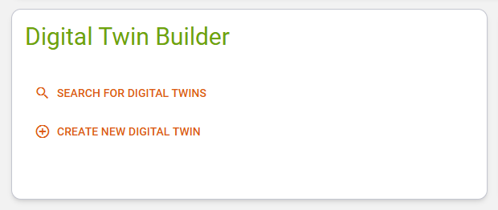{: width='600' }

The Creation Wizard offers two options for creating a digital twin.

### Step 1 - Basis Selection

!!! note
    We plan to include more options for creating twins here, like deriving an instance from a type twin or using a
    blueprint as basis. For now you can choose "from scratch" or "duplicate an existing instance" Stay tuned :)

#### Option 1 - New Digital Twin from Scratch

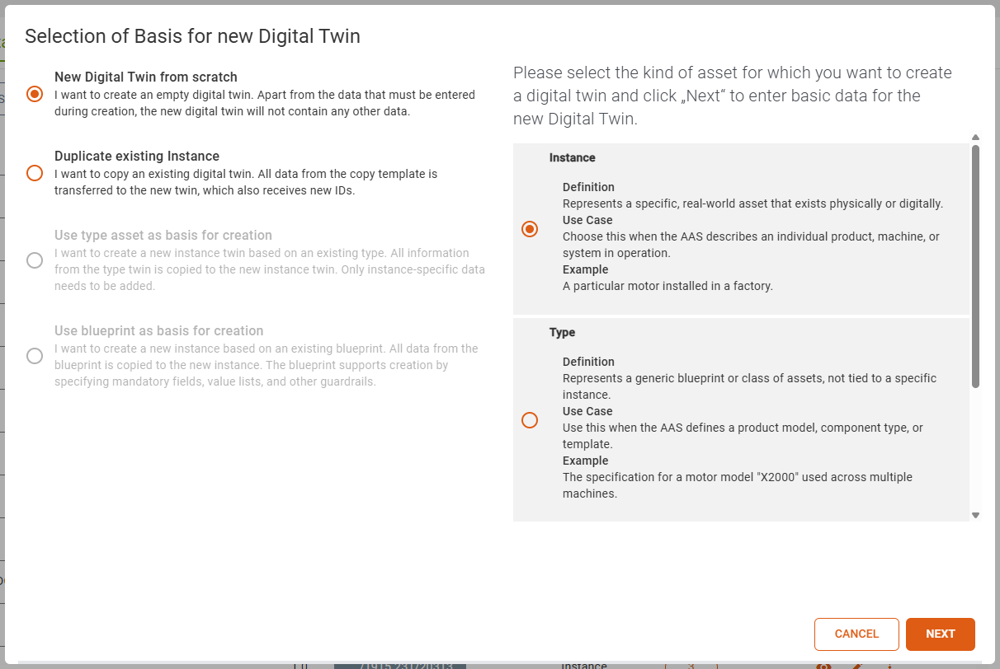{: width='800' }

If you create a digital twin from scratch you can choose the *asset kind* in the right radio button list.
If you are unsure which *asset kind* is appropriate for your situation (*Instance/Type/Undefined*), the help texts
describing the options may be of assistance.

#### Option 2 - Duplicate existing Instance

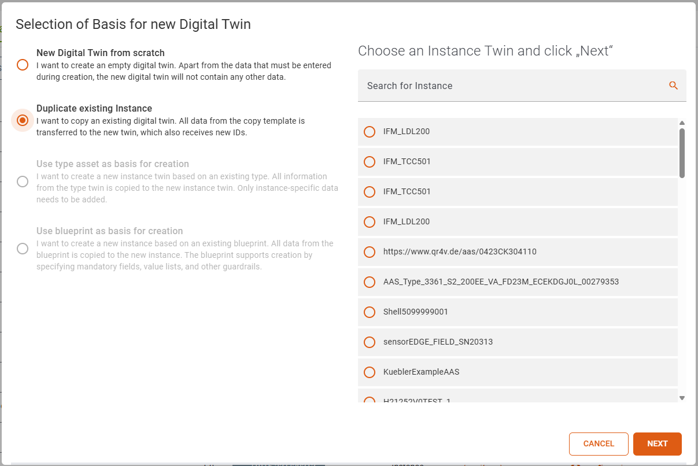{: width='800' }

If you duplicate an existing instance you have to choose an instance from the radio button list on the right.

If you select this option, the wizard will only guide you to step 2 below. No further information is required; it will
be taken from the original copy.

### Step 2 - Add IDs and Basic Information

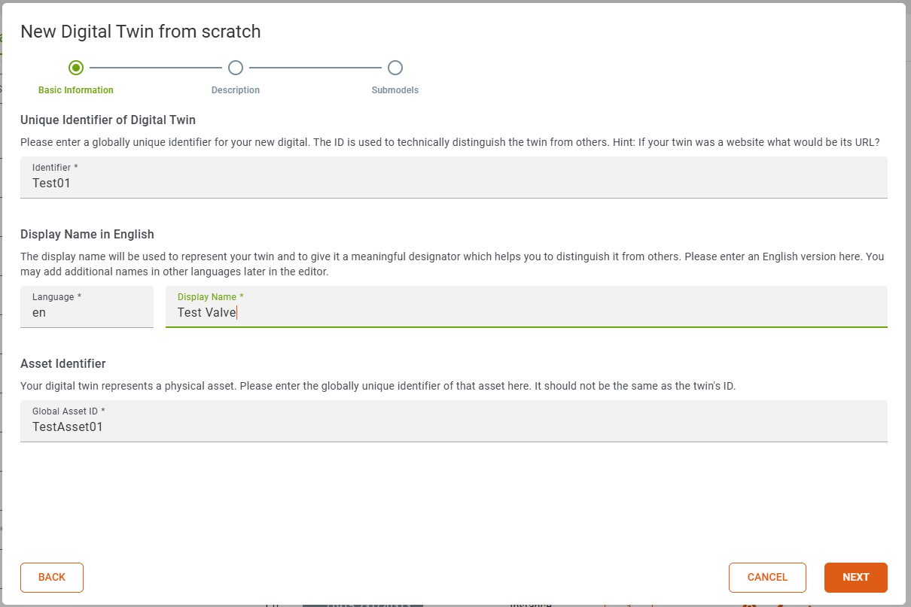{: width='800' }

In the second step you have to set an id for the digital twin, add a display name and refer to your physical asset
by adding a asset identifier.

The id for the digital twin has to be unique.
The asset identifier could be common because you could create many digital twins for one physical asset.
The display name is required because it is used to determine the name of the shell in the catalog.

Depending on your usage of the [ID Generator](studio-general-features.md/#id-generator) feature twinstudio may already
have filled-in some of the inputs above automatically for you.

### Step 3 - Add Description (optional)

{: width='800' }

This step in the creation of a digital twin is optional.
You may add a textual description for the new digital twin here. This might help you and other users later on to
understand the content or purpose of this twin.
Please only use English language here. You may add more/other languages later in the editor.

### Step 4 - Adding Submodels (optional)

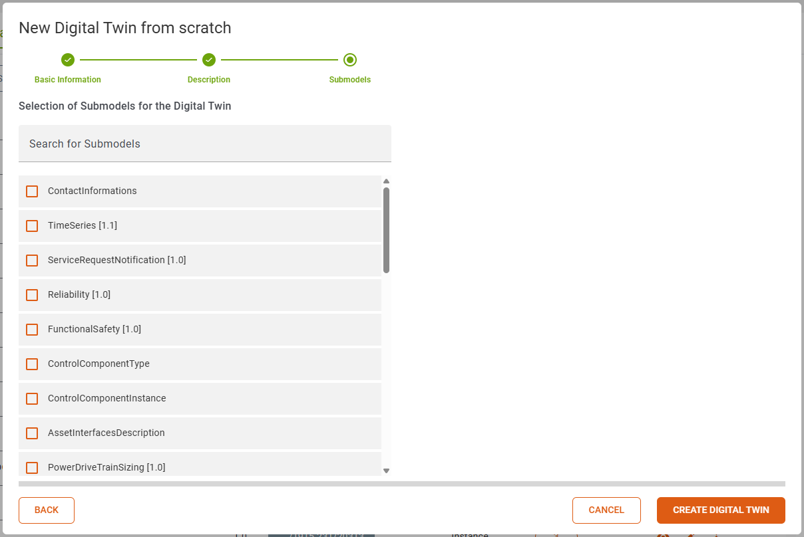{: width='800' }

In the last step of the digital twin creation you can add the submodels you need.
The submodels you can choose from are submodel templates, which are stored in your
[twinsphere cloud](cloud-documentation.md).

If you click the *Create Digital Twin* button every selected submodel template will be transformed
into a submodel instance, given an unique ID and added to your digital twin.

We highly recommend using the studio's [ID Generator](studio-general-features.md/#id-generator) feature here. Otherwise
will use the aas-id value appended by "/sm/{ULID}" automatically for all new submodel IDs to be created.

## Edit Shell Properties

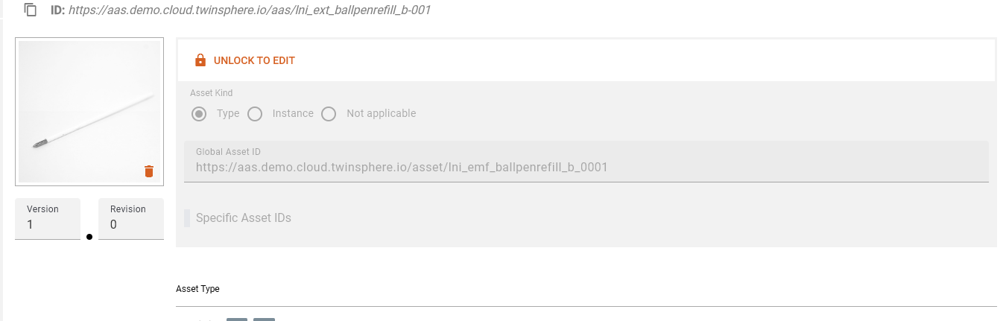{: width='600' }

If you want to edit properties (*asset kind, global asset id and specific asset ids*) of your shell
the editing has to be unlocked.

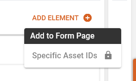{: width='200' }

Via the dropdown you can add specific asset ids, if the editing has been enabled.

The asset type of the shell is shown in the row below these properties.
If the url points to an existing twin in your current tenant, a link to it will be displayed.

## Add/Remove Submodels

The Submodels of your currently opened twin can be edited via the *edit submodel* button in the top right corner.

{: width='600' }

The current submodels of your twin are at the top of the list.
The rest of the list contains all available submodel templates from your current tenant.
To select the same template multiple times you have to add them one at a time.

If a new submodel template is added it will be converted to a submodel of type instance
and its elements are modified to reflect this change.

## Add/Remove Submodel Elements

In the navigation list a symbol is displayed in every submodel entry.
This states if the template for your submodel has been found in your tenant.

If this is the case you can find the *add element* button on some of the submodel elements.
There are an *add to navigation* and *add to page* section.

{: width='200' }

Adding a navigation element will insert a child in the navigation tree. To delete this element you have to visit the node.

Adding an element to the page will cluster similar elements. Next to them there will be a trash can to delete each entry.

Some templates specify a cardinality of *one* or *onetomany* then the last element cannot be removed.

## Arbitrary Properties

Some templates specify arbitrary properties. At the moment twinstudio only supports editing the first.
Twinstudio cannot assume in good faith the correct idShort for additional elements.

{: width='500' }

In the add dialog these entries are grayed out and display the info.

## Fill-In Submodel Element Values

### Properties

Property elements have a valuetype according to which the different selection elements will be displayed.
The types of time, date and datetime have a custom representation, all others are shown in a default input field.

#### Default

The value of a property is represented by an input field.
Please make sure that the data type of the property matches the value you set into the input field.
The *Validation Issue List* will have an issue if the data type of the value does not match
the data type of the property.
The input field expands up to 5 rows and a scrollbar will be displayed for longer content.

#### Date

The selected value will be displayed in local date (according to browser locale, in the image the locale was set to **de**).
In the calendar popup you can navigate between months with the arrow buttons.  
By clicking the month-year the year selection will be shown
and after selecting a year you will be returned to the initial calendar.
The clear button will set the value to *null*.

#### Time

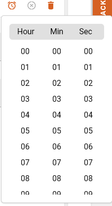

The selected value will be displayed in local time (according to browser locale, in the image the locale was set to **de**).
In the time popup you can select hours, minutes and seconds. AM PM selection will only be shown if your locale suggests it.
The columns are scrollable to reach desired values.  
By clicking the month-year the year selection will be
shown and after selecting a year you will be returned to the initial calendar.
The clear button will set the value to *null*.

#### Date-Time

The selected value will be displayed in local date time
(according to browser locale, in the image the locale was set to **de**).
In the dropdown there is a combination of the calendar and the time selection.  
By clicking the month-year the year selection will be shown
and after selecting a year you will be returned to the initial calendar.
The clear button will set the value to *null*.

### Multi Language Properties

The Multi Language Properties displays all languages for which a value is set, with tags above the value.
The initially displayed value in the field is determined as follows using the languages of an entry
and match it with (ISO 639-1):

1. the data language
2. containing the data language
3. the ui language
4. containing the ui language
5. english (en)
6. containing english (en)

You can select another language value by clicking on the corresponding language tag.
Hovering over a tag will display an indicator above it.
The selected language is highlighted with a gray background.

{: width='800' }

The dialog box that opens when you click on the pencil icon shows all the values
that have been set for the Multi Language Property.
You can add new values and delete existing ones. Make sure that at least one value is set.
The value input fields expands up to 5 rows and a scrollbar will be displayed for longer content.
At the top, you can see which value will be displayed when you click *Save*.
If you click on the info icon, you will see an explanation of why this value was selected.

### File Elements

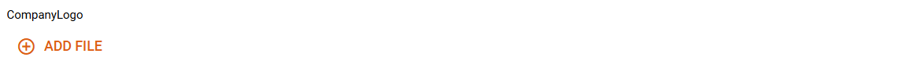

You can fill in the *file* elements by clicking on the *Add File* button.

{: width='800' }

In the dialog box, you can now choose whether you want to upload a file or store an external file.
If you upload a file, it will be stored in the twinsphere file storage and a reference will be written to the element.
If you store an external file, the link will be stored as a value.
If no content type is specified in the template, the content type is set to octet-stream.
File links that would overflow the input will be clipped.

### Range

The *Range* can set minimum and maximum as values.
If it is required, either a minimum or maximum value has to be set to satisfy the validation.
If the data type describes a number (according to [xsd schema](https://www.w3.org/TR/xmlschema11-2/#built-in-primitive-datatypes)),
it is validated whether the minimum is smaller than the maximum.

### Reference Elements

To set the value of a *reference* element, click the *Add Reference* button
and then select an asset administration shell.
You can then refer to a submodel or submodel element and save the reference.
The reference is displayed as shown below.

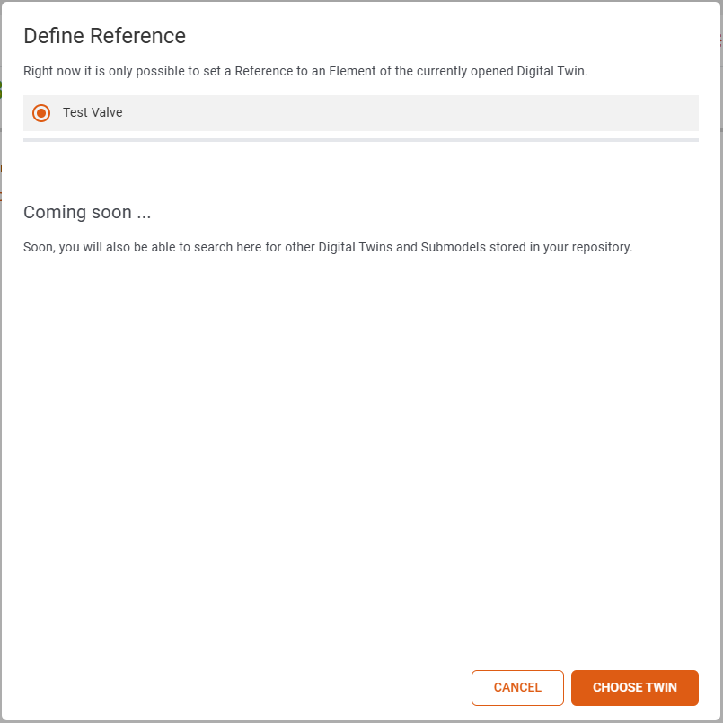

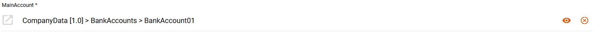

!!!note "Current limitations"
    Reference Elements only support referencing submodels and submodel elements within the same twin.
    This behavior will be changed in future releases.

### Entity

This element is displayed in the tree on the left. On the page you can select to set a reference to an existing twin.
If selected an input field is shown in which the *globalAssetId* of a twin has to be entered.
When the twin exists in the twinsphere a link to the **AAS-Viewer** is activated.

{: width='800'}

The button with the *magnifying glass* icon opens a dialog in which it is possible to search for a twin.
Only 10 results will be shown. Twins without a *globalAssetId* will be disabled for selection.

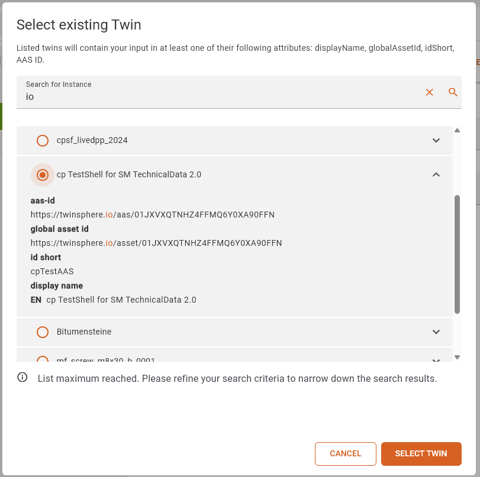{: width='400' }

## Validation Issue List

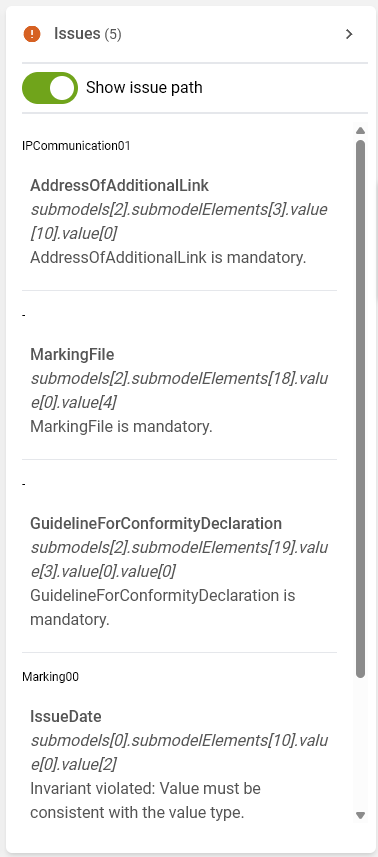{: width='300' }

After each value change your twin gets validated.
The count of issues will be displayed atop of the list.

The errors are grouped by their path which can be displayed with the show issue path toggle.

Clicking on an issue will navigat you to the element and the edit mode will be opened.

## Save Draft

To save a draft, simply click on the *Save Draft* button. Once saved, a toast message will appear
in the upper left corner. Drafts are only visible to you and can only be edited or deleted by you.
You can view all your drafts in the [draft catalog](studio-catalog.md).

## Publish to Repo

To publish a digital twin, all errors in the error list must be corrected.
Once all errors have been corrected, the twin can be published by clicking the "Publish" button.
Once the twin has been successfully published, a dialog box displays the ID, name, and tenant
to which the twin was uploaded.
Once the twin has been published, the corresponding draft is deleted from the draft catalog.

## Branding

Each twin and all of its submodels that are edited with *twinstudio* will receive an extension which contains
the *twinstudio* branding with its current version.

## Save State

The save state display shows you the current state of the draft or twin you are working on.
There are three save states for a twin:

- Unsaved Changes
- Draft Saved
- Published

### Unsaved Changes

The Unsaved changes status indicates that changes have been made to the twin or draft that have not yet been saved.
These can be saved by [publishing](#publish-to-repo) or [saving](#save-draft).

### Draft Saved

The Draft Saved status indicates that the draft has been saved as a draft.

### Published

The Published status indicates that the draft/twin has been published
in your repository or has been loaded from the repository in this state.

## Show Twin in AAS Viewer

If you have a design/twin with the status Published open in the editor,
you can click on the eye icon next to the memory status display to open the design/twin in AASViewer.

