# twinstudio Twin Builder

## What the Twin Builder is

The **Twin Builder** is the editor of twinstudio. It is where the content of a digital twin is filled in and changed.
It shows one field per element and hides the complexity of the AAS metamodel behind forms, while still validating
everything you enter against that metamodel.

## Twin creation wizard

The wizard guides you through the creation of a digital twin. Open it with **Create new Digital Twin** on the
[dashboard](studio-general-features.md#dashboard) or in the [twin catalogue](studio-catalog.md#catalogue-of-digital-twins).

### Choosing a basis

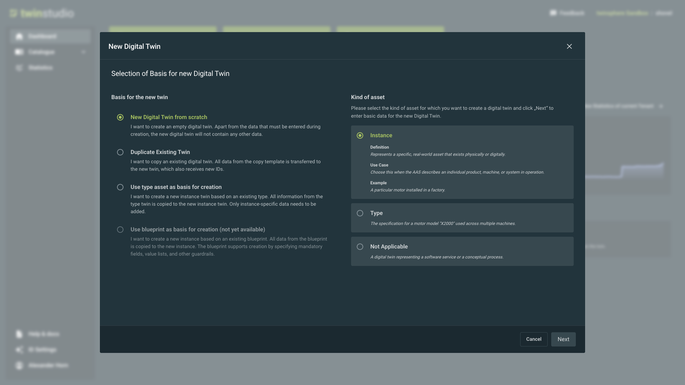

The first screen asks two things: what the new twin is based on, and which kind of asset it describes.

| Basis | What it means | What you still enter |
|---|---|---|
| **New Digital Twin from scratch** | An empty twin with nothing but the basic information. | Everything |
| **Duplicate Existing Twin** | A copy of an existing twin, with new identifiers. | Values you want to change |
| **Use type asset as basis for creation** | A new instance built from an existing type twin. | Instance-specific values |
| **Use blueprint as basis for creation** | Not available yet | - |

When you duplicate a twin, you search for the twin to copy. Enter at least 3 characters and press Enter. The search
looks at the display name, the global asset ID, the idShort and the AAS ID. If the list reaches its maximum, twinstudio
asks you to narrow the search.

By default, all submodels of the copied twin are copied as well. If you want to link a submodel instead, change that in
the editor afterwards. Submodels of kind *template* are not copied. twinstudio tells you when the twin you selected
contains such submodels.

The **Kind of asset** selection on the right explains the three options and gives a use case and an example for each,
so you can pick the right one even if you have not met the term before:

- **Instance** describes one specific real asset that exists physically or digitally, for example a particular motor
  installed in a factory.
- **Type** describes a product model or component type that is used in many places, for example the specification for
  a motor model *X2000*.
- **Not Applicable** is for twins that do not represent a physical asset, such as a software service or a conceptual
  process.

### Step 1: Basic information

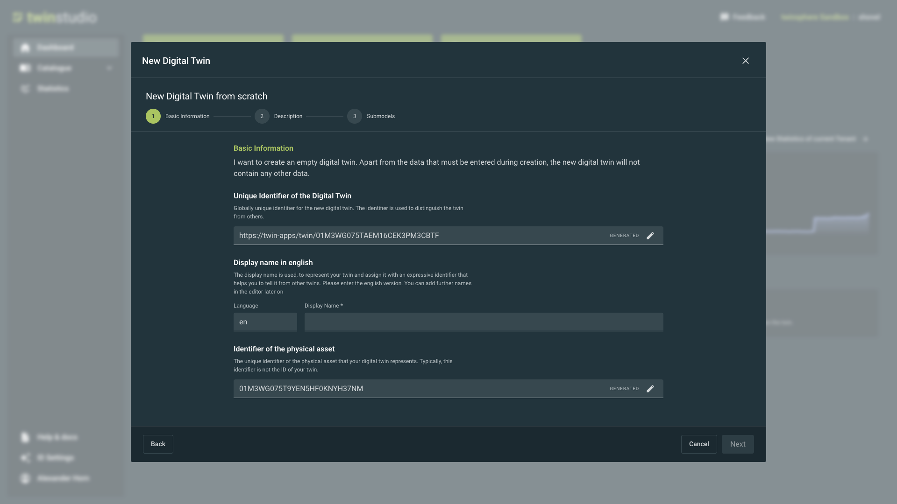{: width='900' }

| Field | Notes |
|---|---|
| **Identifier** | The globally unique identifier of the twin. Generated when the ID generator is on |
| **Display Name** | Required. The name the twin is listed under. Enter the English name; the language is fixed to `en` |
| **Global Asset ID** | The identifier of the physical asset, which is usually *not* the twin's own identifier |

The explanation under each field tells you what it is for. If a value was generated, the field is marked **Generated**.
Use **Edit Identifier** or **Edit Asset ID** to replace a generated value with your own.

### Step 2: Description

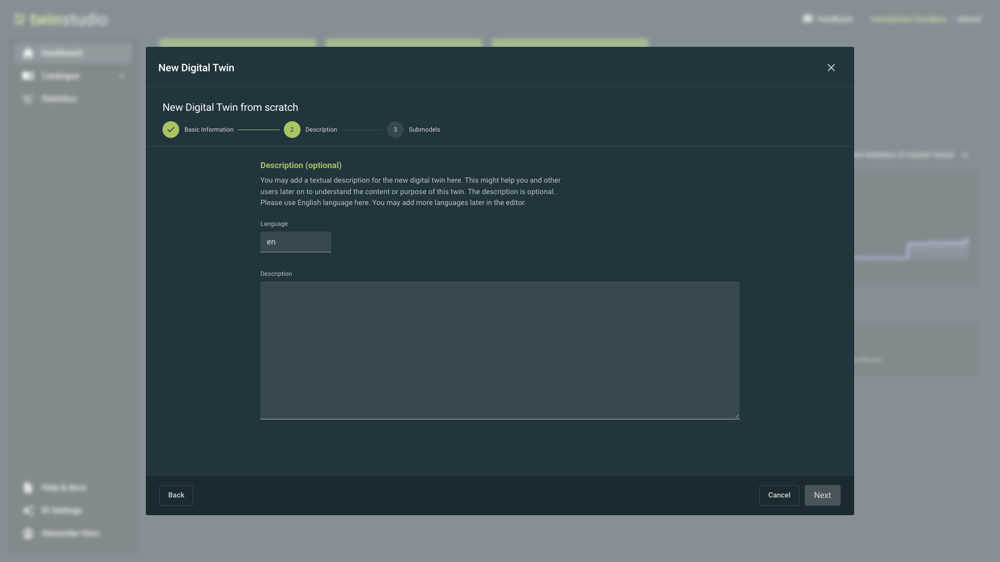{: width='900' }

The description is optional. It helps you and others recognise the purpose of the twin later. Enter the English text
here; more languages can be added in the editor.

### Step 3: Submodels

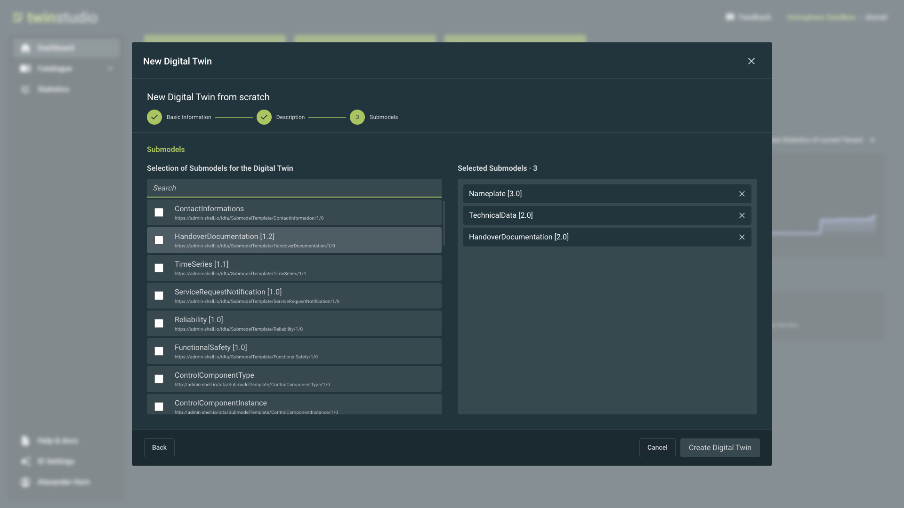{: width='900' }

Select the submodel templates the new twin should start with. You can search the list, and the panel on the right shows
the templates you have selected so far. If you select none, the twin is created empty and you can add submodels later in
the editor. Each selected template is turned into a submodel instance, given a unique identifier and attached to the
twin.

We recommend switching on the [ID generator](studio-general-features.md#id-settings) for submodels before creating
twins. Without it, every new submodel identifier is built by appending `/sm/{ULID}` to the identifier of the twin.

Select **Create Digital Twin** to finish. You land in the editor with the new twin open.

## The editor

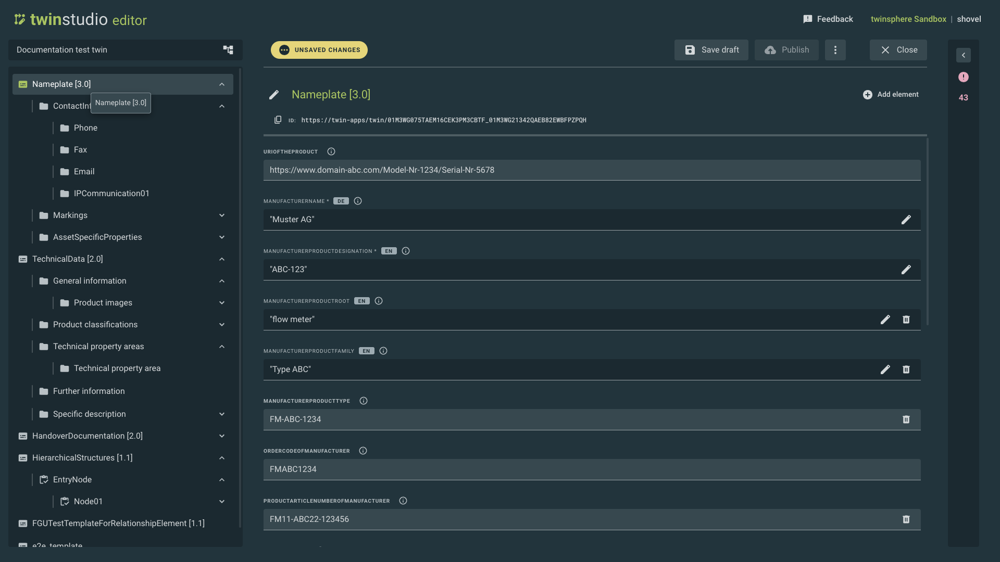

### The toolbar

| Control | What it does |
|---|---|
| **Published**, **Draft saved**, **Unsaved changes** | The current save state of the twin |
| Eye icon | Opens the twin in the twinsphere Viewer. Only shown for a published twin |
| **Save draft** | Stores your work as a private draft |
| **Publish** | Writes the twin to your twinsphere tenant. Only available when the twin has no validation issues |
| **More actions** | Opens a menu with **Export** and **Edit Submodels** |
| **Close** | Leaves the editor |

The strip on the right edge shows the number of validation issues. Select it to open the [issue list](#validation-issues).

### The navigation tree

The left-hand side lists the submodels of the twin. Expand a submodel to reach its elements. The icon in front of each
submodel tells you whether twinstudio found the template of the submodel in your tenant:

- **Template found:** the icon shows a caption symbol. Hover over it to see the name and version of the template. The
  editor can then validate the submodel and offer the elements the template defines.
- **Template not found:** the icon shows a crossed-out caption symbol in yellow. Hover over it to see why. The tooltip
  reads **Submodel Template not available** together with the template name, or **Unknown or Custom Submodel Template**
  if twinstudio does not know the template at all. You can still edit the existing values, but the editor cannot tell
  you which elements are missing.

Select **Edit Submodels** above the tree to add or remove submodels.

### The form

The main area shows the element you selected in the tree, as a form. Which input is shown depends on the type of the
element. A star after the name of a field marks it as mandatory. If the template gives the element a definition, an
information icon next to the name shows that definition when you hover over it.

If a saved draft exists for the twin you open, twinstudio asks which version you want to work on: the twin from the
repository (**Open Original**) or your draft (**Open Draft**). If you load the original and save it, the stored draft is
overwritten.

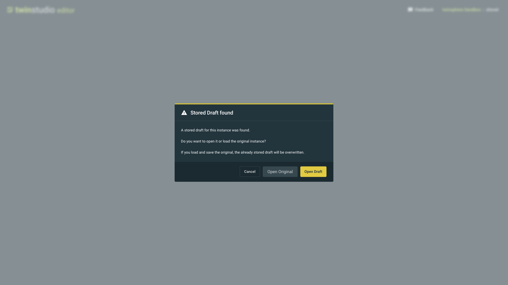{: width='900' }

## Shell metadata

The root of the tree is the shell itself. It holds the data that identifies the twin rather than the asset's data.

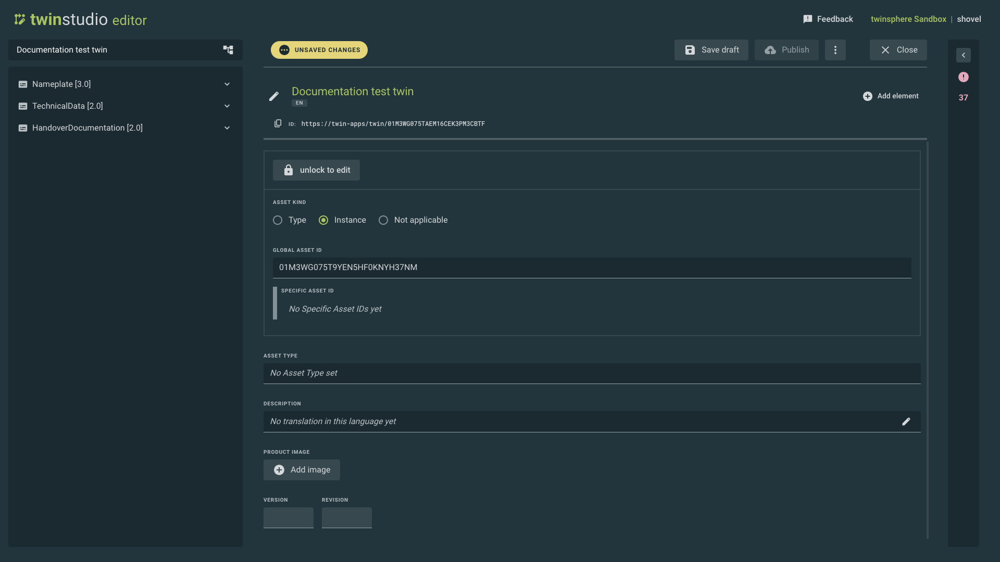

This data is protected because changing it carelessly can break references elsewhere. Select **unlock to edit** to make
it editable and confirm the warning with **Proceed**. Select **lock to protect** to protect it again.

| Field | Meaning |
|---|---|
| **Asset kind** | *Type*, *Instance* or *Not applicable* |
| **Global Asset ID** | The identifier of the physical asset. While unlocked, the button next to the field replaces the value with a newly generated ID that follows your [asset ID pattern](studio-general-features.md#id-settings) |
| **Specific Asset ID** | Further identifiers of the asset, such as a serial number or a customer key |
| **Asset type** | A reference to the type twin this instance is based on. A link is shown when it exists in the tenant |
| **Description** | A free-text description of the twin |
| **Product image** | A thumbnail shown in the catalogue |
| **Version** and **Revision** | The version of the twin and of the revision that produced it |

To add a specific asset ID, unlock the metadata, select **Add element** next to the name of the twin and choose
**Specific Asset ID**. While the metadata is locked, this entry is disabled. Each specific asset ID has a name and a
value.

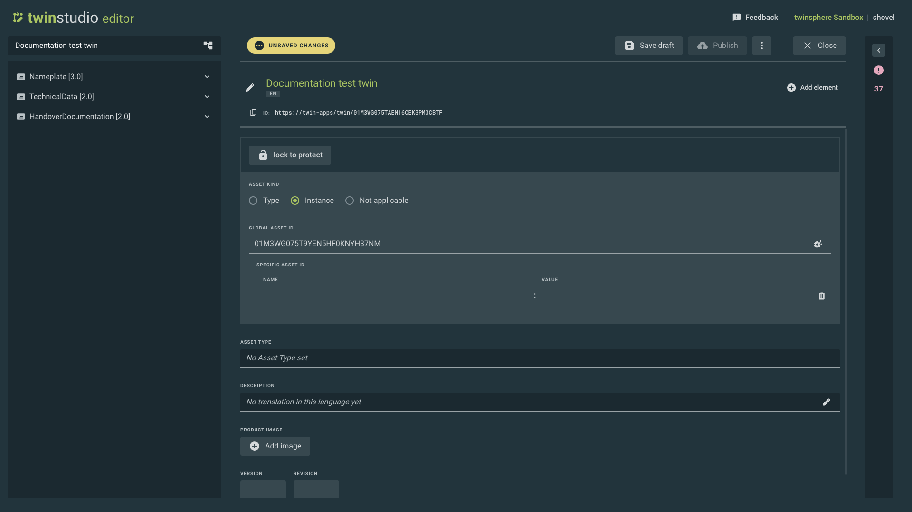

## Adding and removing submodels

Select **Edit Submodels** above the navigation tree, or use the entry in the **More actions** menu.

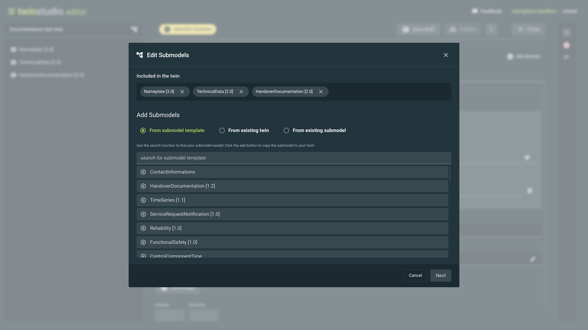{: width='900' }

The top of the dialog lists the submodels the twin currently has. Select the cross on a submodel to mark it for
removal. It is shown struck through, and the arrow next to it undoes the removal. Nothing is removed until you confirm
the dialog.

New submodels come from one of three sources, one per option:

| Source | How it works |
|---|---|
| **From submodel template** | Search the templates in your tenant and add one with the plus icon |
| **From existing twin** | Search for a twin, then choose which of its submodels to add. Enter at least 3 characters and press Enter. The search looks at the display name, the global asset ID, the idShort and the AAS ID. At most ten matches are listed |
| **From existing submodel** | Enter the full submodel ID and select **Resolve**. Partial IDs are not supported. twinstudio tells you whether the ID is valid |

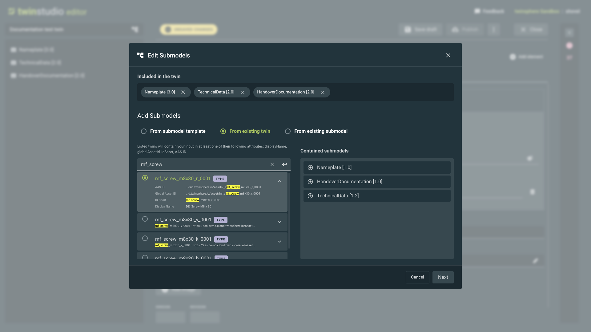{: width='900' }

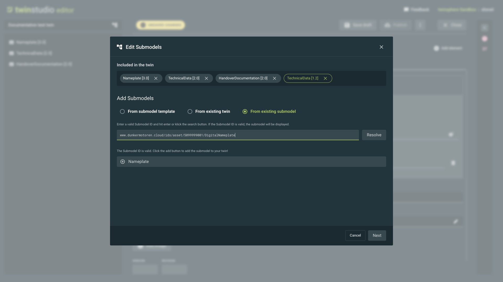{: width='900' }

Submodels you have added appear highlighted in the list at the top. Select **Next** to review the changes, then **Set**
to apply them. A submodel that comes from a template is always created as a new copy of the template. For every
submodel you add from an existing twin or an existing submodel, you choose between two modes:

- **copy** - the submodel is duplicated with new identifiers and is fully independent afterwards.
- **reference** - the submodel is shared. Changes to it affect every twin that references it.

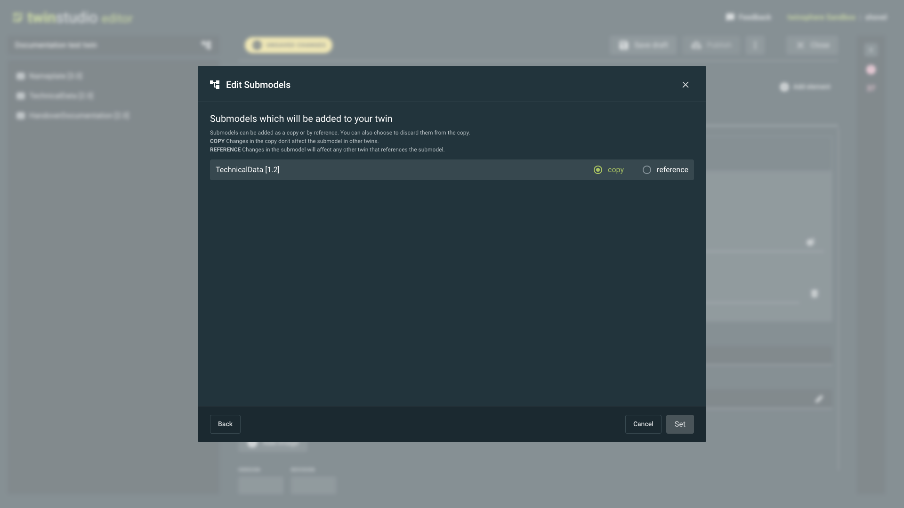{: width='900' }

The same submodel can be added to a twin more than once.

## Adding and removing elements

If the template of a submodel could be resolved, the editor knows which elements it allows and offers an
**Add element** menu. The menu is grouped into two sections:

- **Add to Tree Navigation** adds a child node that also appears in the navigation tree. To remove it, open that node
  and delete it there.
- **Add to Form Page** adds a further field next to the existing ones. Each added field has its own delete button.

Entries that cannot be added, for example because the element already exists, are greyed out.

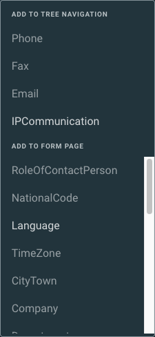{: width='220' }

If the template specifies a cardinality of *one*, the last remaining element cannot be removed.

### Custom elements

Some templates allow additional elements that the template itself does not describe. These are called *custom
elements*. In the **Add element** menu they appear as **Custom Element**. Choosing one opens the **Create Custom
Element** dialog, which has three steps:

1. **Select Semantic** - choose the meaning of the new element. The best option is to select a concept description
   from your tenant; the list shows the first 50 results, and you can search it by name. Alternatively, enter a
   characteristic reference such as an ECLASS ID. **Set no meaning** is possible but not recommended, because the
   element cannot be processed by a machine afterwards.
2. **Select Name** - the name shown to users in the interface. Give the English name; use **Add localisation** to add
   further languages. Each name must be longer than one character, must not start with a number and must not contain line
   breaks or tabs. It can have at most 126 characters.
3. **Select Type** - which values are allowed.

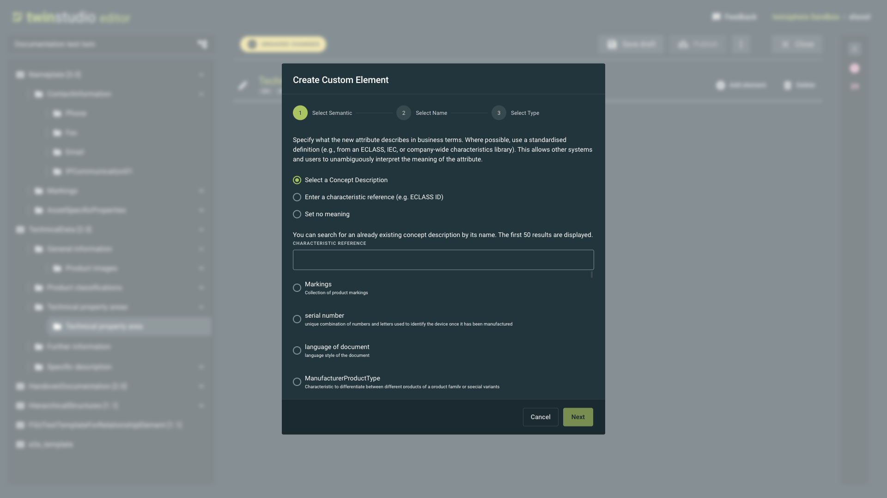{: width='900' }

The types are grouped as follows. The dialog only offers the types the template allows, so the list can be shorter.

| Group | Types |
|---|---|
| Text | Monolingual, Multilingual |
| Number | Integer, Floating-point |
| Range | Integer, Floating-point |
| Date/Time | Date, Time, Date with Time |
| Other | Boolean, Link, and File if the template allows files |

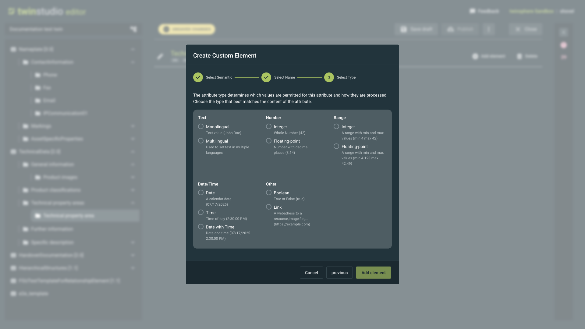{: width='900' }

## Filling in values

Every change is validated as you make it. The result appears in the [issue list](#validation-issues). Some messages
appear only after you leave a field.

### Properties

A property is shown as an input field.

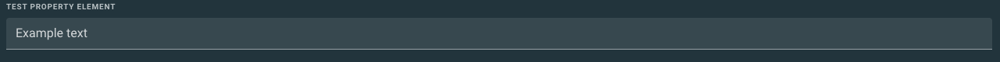

Make sure the value matches the data type of the property. The issue list reports a mismatch. A text field grows up to
five lines and then scrolls.

If the submodel template defines a qualifier of type **FormChoices**, the allowed values are offered as a drop-down
instead of a free text field.

If the template defines a unit for the property, the unit is shown next to the field.

### Date, time and date with time

Properties with the value types `xs:date`, `xs:time` and `xs:dateTime` are filled in with dedicated controls instead of
a free-text field, which removes the need to know the ISO format.

#### Date

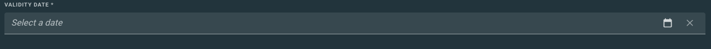

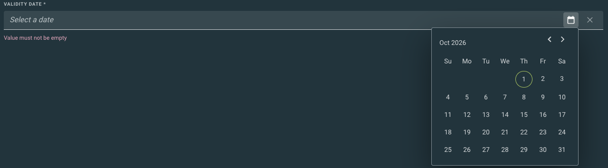

The value is shown in the date format of your browser language. In the calendar you can move between months with the
arrows. Select the month and year at the top to choose a different year from a list. The cross clears the value.

#### Time

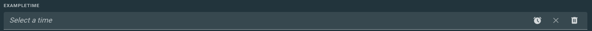

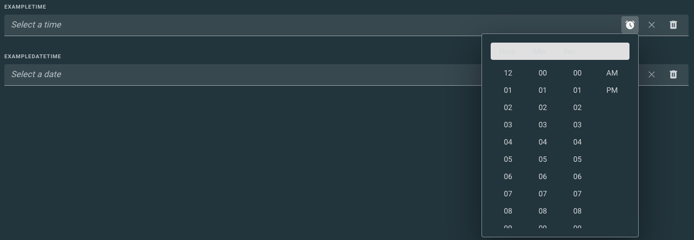

The value is shown in the time format of your browser language. The columns in the pop-up scroll, and hour, minute and
second are selected separately. AM and PM are only offered if your locale uses them. The cross clears the value.

#### Date with time

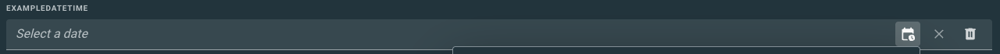

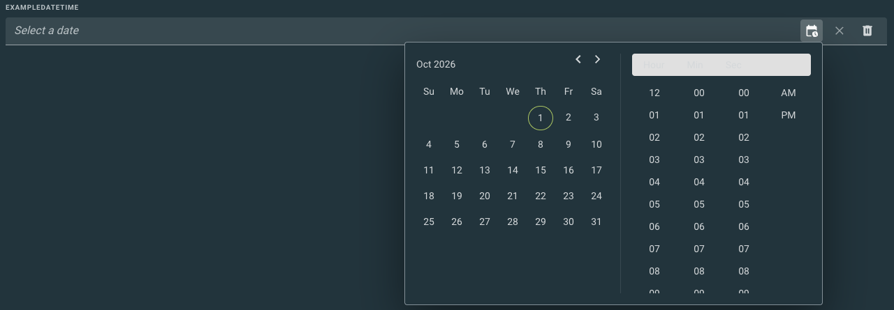

The pop-up combines the calendar and the time selection. The cross clears the value.

### Multi-language properties

A multi-language property holds the same text in several languages.

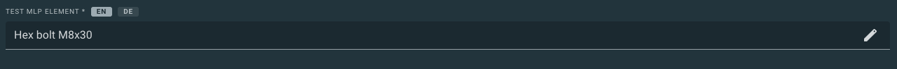

The languages that have a value are shown as tags next to the name of the field, and the field itself shows one of them.
Which one is shown follows the same order as everywhere else in twinstudio: your data language first, then your
interface language, then English, and finally the first language that has a value at all. Select a tag to display that
language instead.

Select the pencil icon to open the editing dialog.

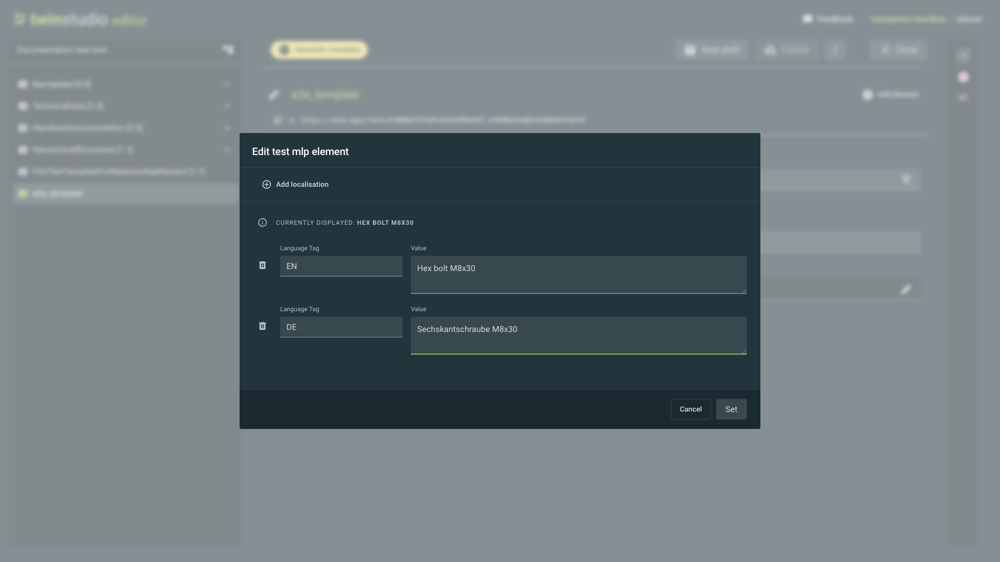{: width='900' }

The dialog lists every language that has a value. Use **Add localisation** to add a language and the bin icon to delete
one. A language may only be used once. **Set** applies your changes and is disabled while an input is invalid. The line
**Currently displayed** shows which value is displayed after saving, and the information icon next to it lists the
order described above.

### Files

A file element points either to a file on your computer or to a file in the twinsphere file repository.

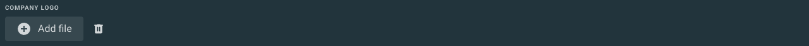

Select **Add file** to open the dialog and choose one of three sources:

- **I want to upload a file** stores the file in the file repository and writes a reference into the element.
- **I want to add a link to an external file** stores the link as the value.
- **I want to choose a file from twinsphere file repository** selects a file that is already stored, instead of
  uploading it again.

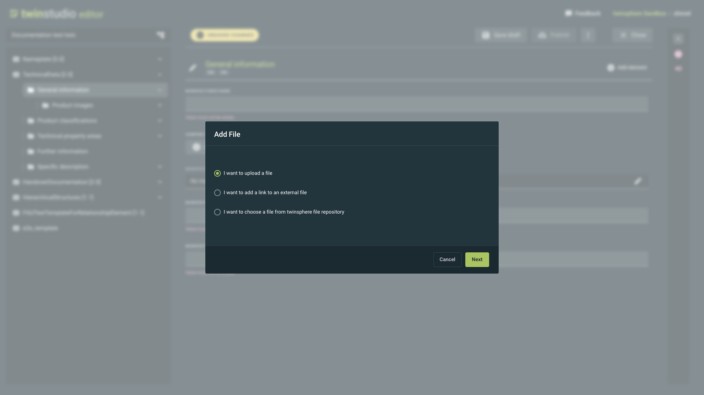{: width='900' }

Once a file is set, a tag next to the name of the field shows its type, for example `png`. The tag reads **URL** for a
link to a file outside twinsphere. The field shows the link, and its tooltip shows the full value if it is cut off. The
icons at the end of the field download the file, clear the value, or delete the element. The delete icon is only shown
for elements that are optional or may occur more than once.

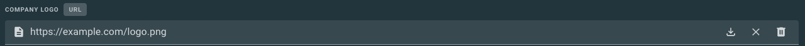

twinstudio stores the content type of the file with the element. If it cannot determine one, it uses
`application/octet-stream`.

### Ranges

A range element has a minimum and a maximum.

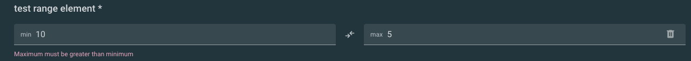

If the template marks the element as mandatory, at least one of the two values has to be set. For numeric data types the
editor reports an error if the maximum is smaller than the minimum.

If the template defines a unit for the range, the unit is shown next to the field.

### References

A reference element points somewhere else. Select **Add Reference** to open the **Set Reference** dialog, and then
choose what kind of target you want:

| Type | Target |
|---|---|
| An element of the current Twin | Any element of the twin you have open, including the twin itself |
| An element of another Twin in the connected twinsphere tenant | A twin, submodel or element stored in the same tenant |
| An external element | Anything outside twinsphere, identified for example by an ECLASS identifier |

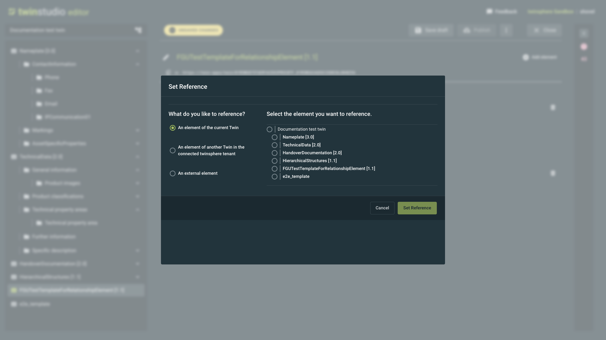{: width='900' }

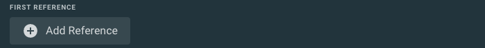

For the current twin, select the target in the tree and confirm with **Set Reference**.

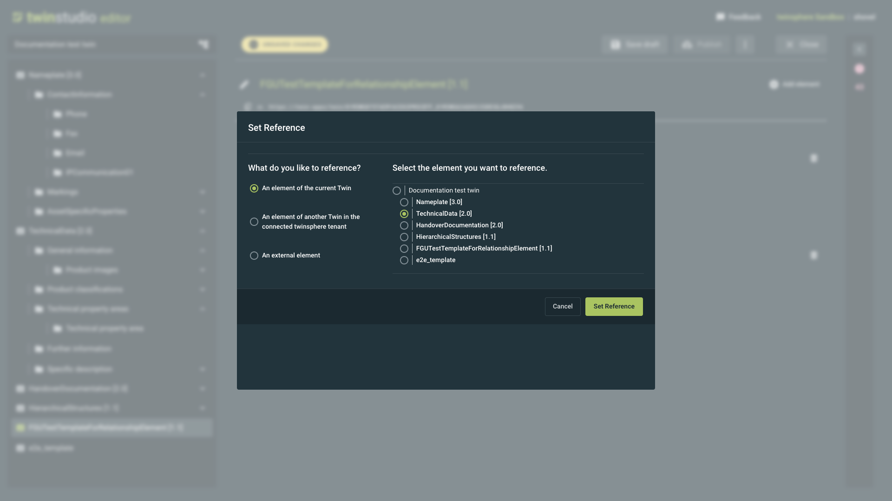{: width='900' }

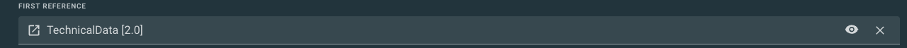

For a twin in twinsphere you first search for the twin. Enter at least 3 characters and press Enter. Select a twin from
the list, confirm with **Choose Twin**, and then pick the submodel or element inside it. **Back** returns to the search.

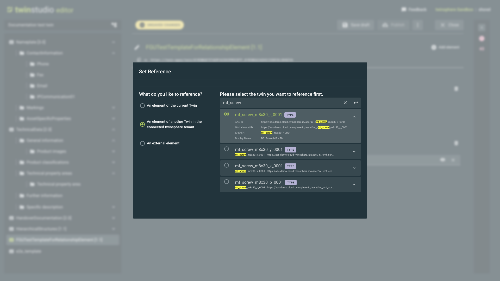{: width='900' }

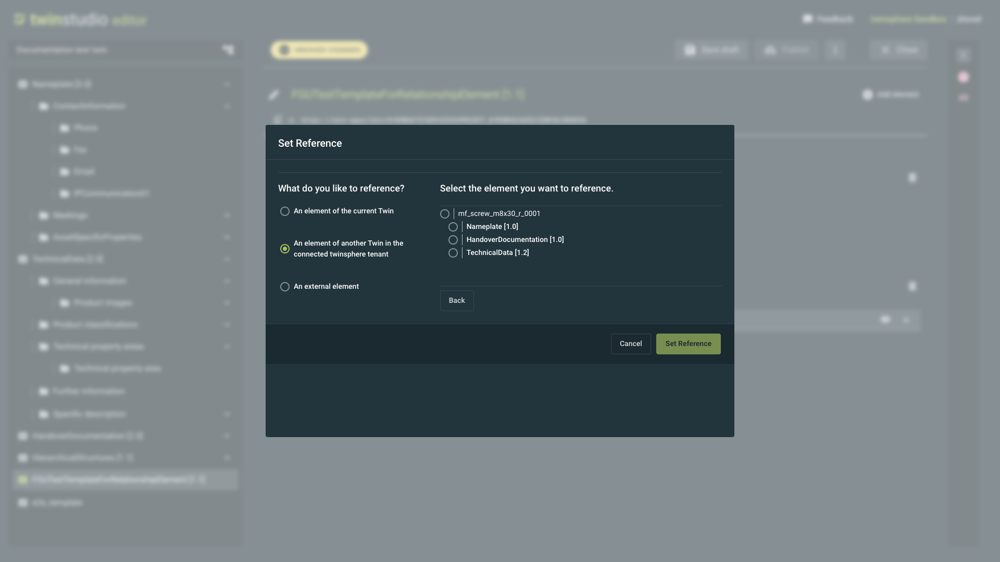{: width='900' }

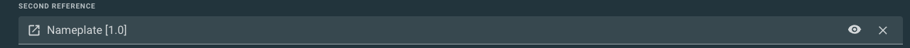

An external reference is typed into the input field.

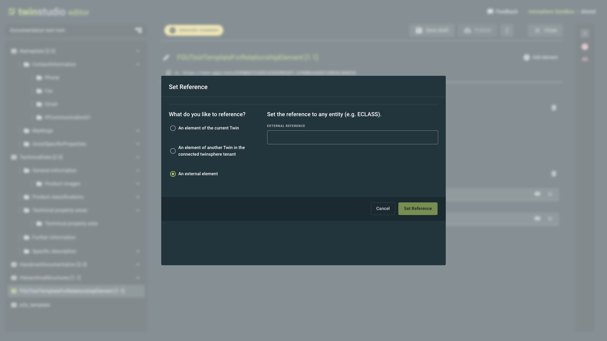{: width='900' }

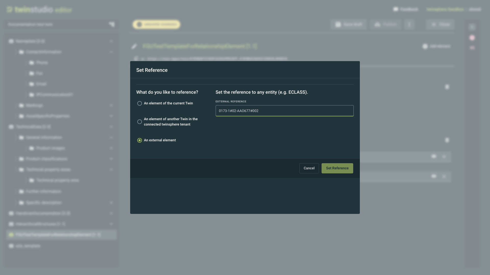{: width='900' }

A filled reference shows a short summary with two icons. The eye icon opens **Reference Details**, which shows the full
target. It is not available for external references. The cross removes the reference, after which you can set a new one.

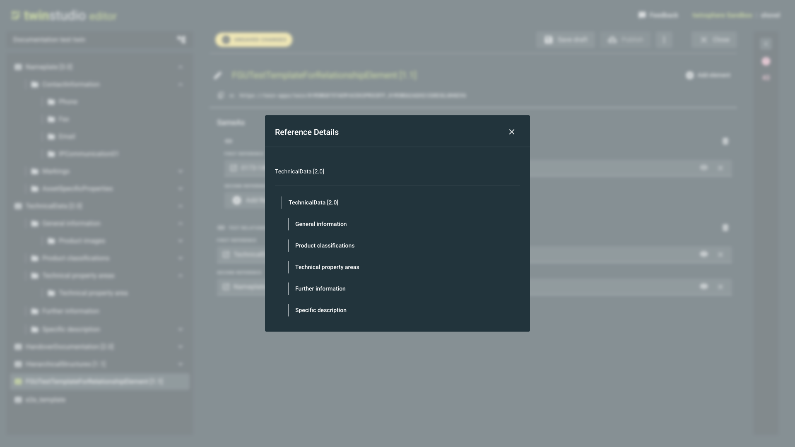{: width='900' }

### Entities

An entity element stands for an object that is described by further elements below it. An entity can reference an
existing twin.

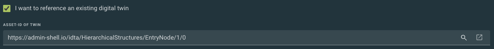

Tick **I want to reference an existing digital twin** and enter the **Asset-ID of twin**. If a twin with that asset ID
exists in the connected tenant, the button at the end of the field becomes available and opens the twin in the AAS
viewer. Otherwise it is disabled and its tooltip explains that the twin does not exist in the connected tenant.

The magnifying glass opens the **Select existing Twin** dialog. Enter at least 3 characters and press Enter. The dialog
lists at most ten matches, and the search looks at the display name, the global asset ID, the idShort and the AAS ID. A
twin without an asset ID cannot be referenced, and twinstudio tells you so.

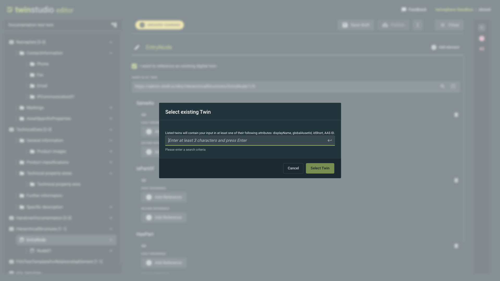{: width='900' }

### Relationship elements

A relationship element connects two references, called the **First Reference** and the **Second Reference**. Both are
filled in exactly like a [reference element](#references).

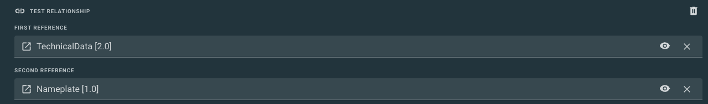

## Validation issues

Every change triggers a validation of the twin.

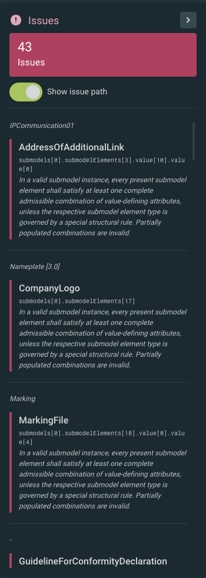{: width='380' }

The number of issues is shown on the strip at the right edge of the editor. Select it to open the list, and select the
arrow in the header of the list to collapse it again. Each entry shows the name of the element, the name of the submodel
or element it belongs to above it, and a message that says what is wrong. The switch **Show issue path** adds the
technical path of the element to every entry. Select an issue to jump to the element that caused it; the editor opens the
element and shows the message at the field.

A twin with issues can be saved as a draft but not published.

## Saving and publishing

### Save draft

**Save draft** stores your work as a draft. A short message confirms it. Drafts are private: only you can see, edit or
delete them, and they are listed in the [draft catalogue](studio-catalog.md#catalogue-of-drafts).

Files that belong to a draft are stored with the draft and only uploaded to twinsphere when the twin is published.

### Publish

**Publish** writes the twin to the twinsphere tenant. All validation issues must be resolved first; if any remain, the
button is disabled and the tooltip points you to the issue list.

After a successful publish a dialog shows the ID, the name and the tenant the twin was written to. The draft it came
from is deleted, and the twin is then listed under **Digital Twins** rather than **Drafts**. If the cloud rejects the
twin, the dialog lists the errors, grouped by shell, submodels and concept descriptions.

### Save state

The toolbar always shows the current state of the twin:

| State | Meaning |
|---|---|
| **Unsaved changes** | You have changed something since the last save or publish |
| **Draft saved** | The current work is stored as a draft |
| **Published** | The twin in the repository matches what you see. This is also the state right after opening a twin |

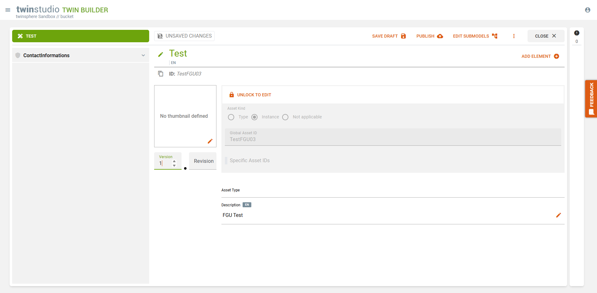

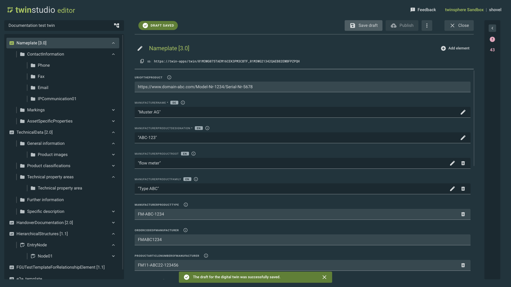

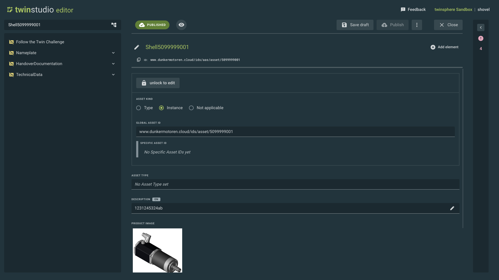

### Closing with unsaved changes

If you close the editor with unsaved changes, twinstudio asks what should happen to them. **Save and close** stores them
as a draft, **Discard and close** drops them, and **Cancel** keeps you in the editor.

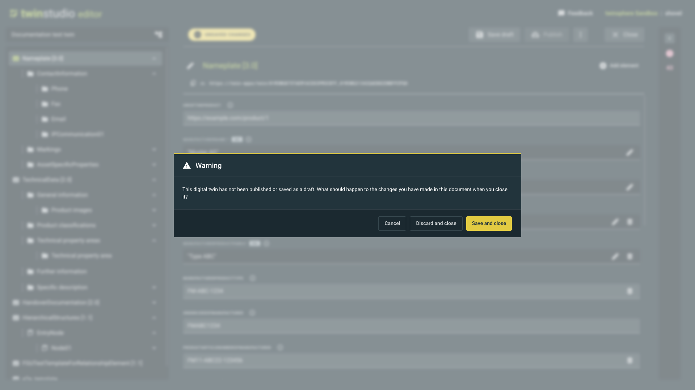{: width='900' }

If your permission to edit was revoked while you were working, for example because a licence or a role was removed, the
draft can no longer be saved. twinstudio tells you so with the message **Draft cannot be saved** instead of losing the
changes silently.

## Exporting a twin

Open **More actions** in the toolbar and select **Export**.

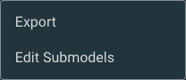{: width='260' }

The export dialog lets you choose, in this order:

1. **Select where to export to:** **Clipboard** or **File**.
2. **Select a format:** JSON, XML or AASX.
3. **Select which submodels to include:** all of them, or a selection.
4. Whether to **include Concept Descriptions**.

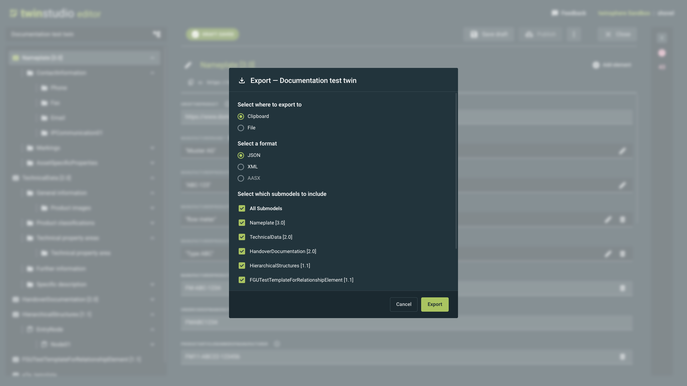{: width='900' }

AASX is only available when the target is **File** and the twin is published and unchanged. The same holds for including
concept descriptions: the option is available for published twins only. An invalid twin can still be exported, but
twinstudio asks for confirmation first (**Export Anyways**).

## Adding a document with the Document AI wizard

!!! warning
    The wizard only accepts PDF files, and it can only add documents to **Handover Documentation** submodels of
    version 2.0.

Instead of filling in the document metadata by hand, you can have a document analysed and added automatically. Select
**Add Document** inside the Handover Documentation submodel and choose your file.

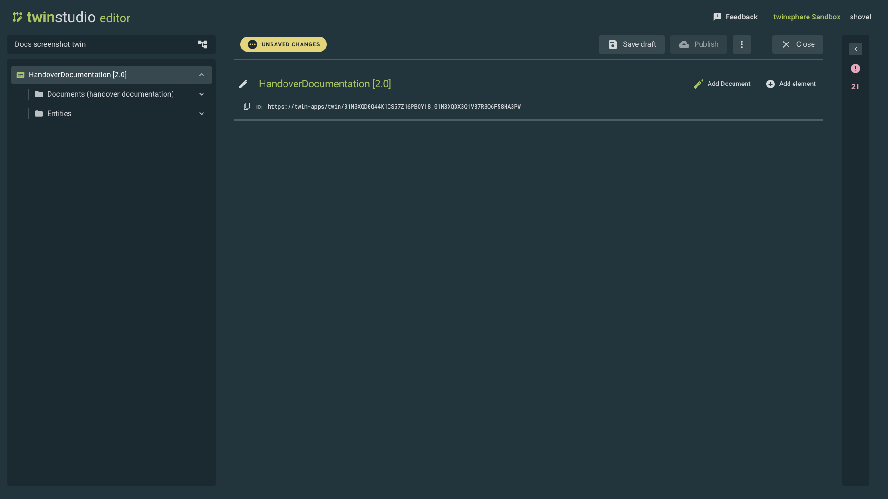

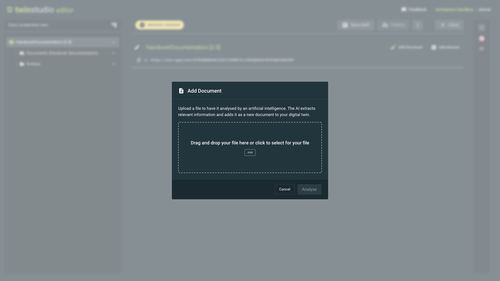

The file is uploaded and analysed.

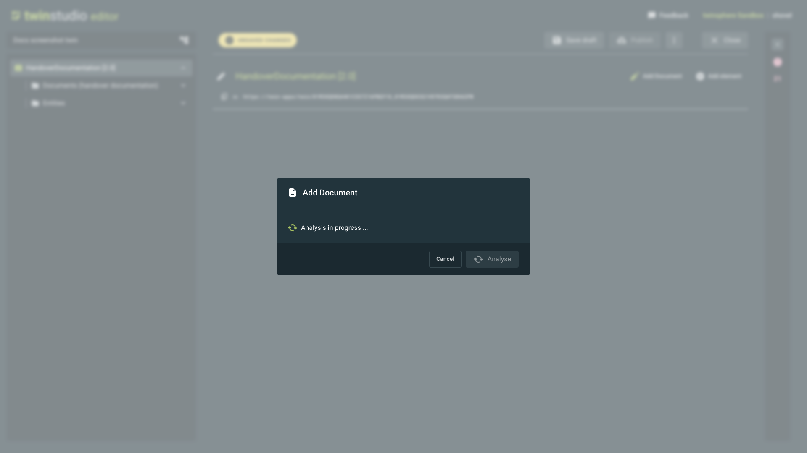

The wizard then proposes the languages, the description, the keywords and the classification of the document. Each
proposal comes with a confidence value, so you can judge how reliable it is, and you can correct anything before you
confirm.

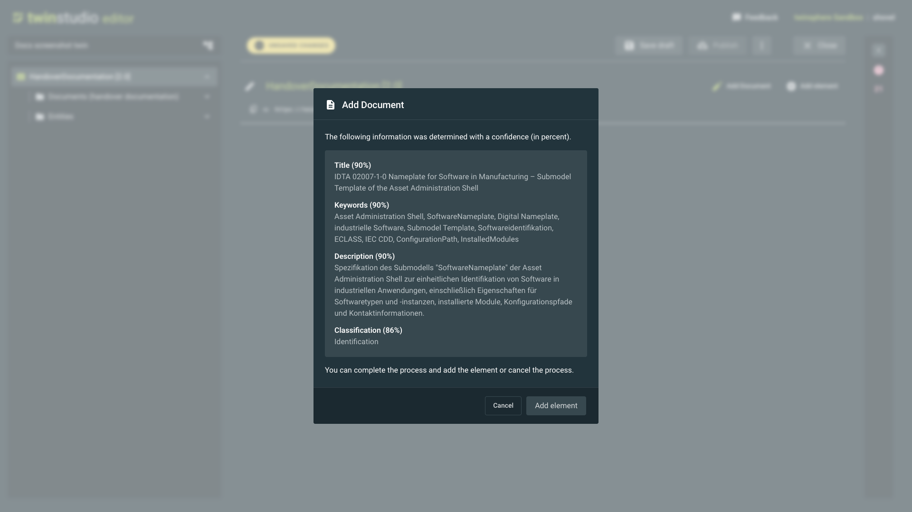

After the document has been added, the wizard takes you to the new element so you can review it.

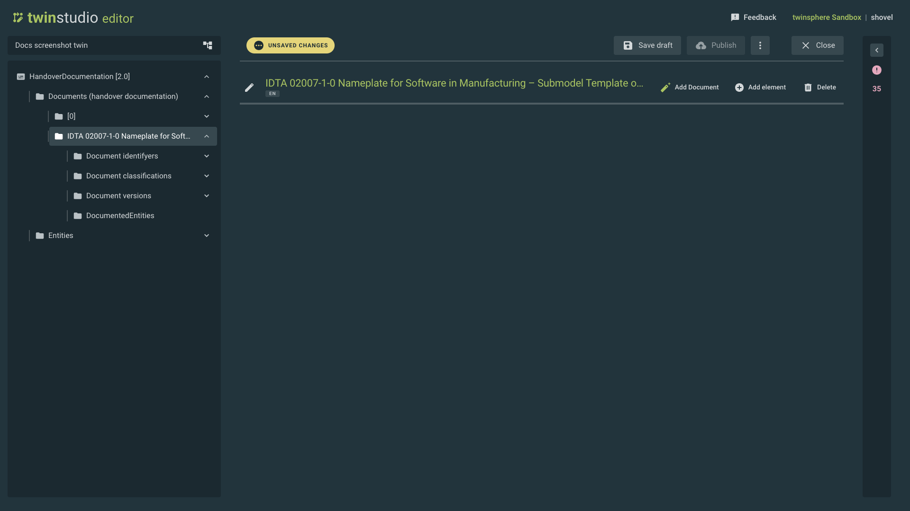

## Branding

Every twin and submodel you edit with twinstudio receives an extension that records the twinstudio branding with the
version that wrote it.
