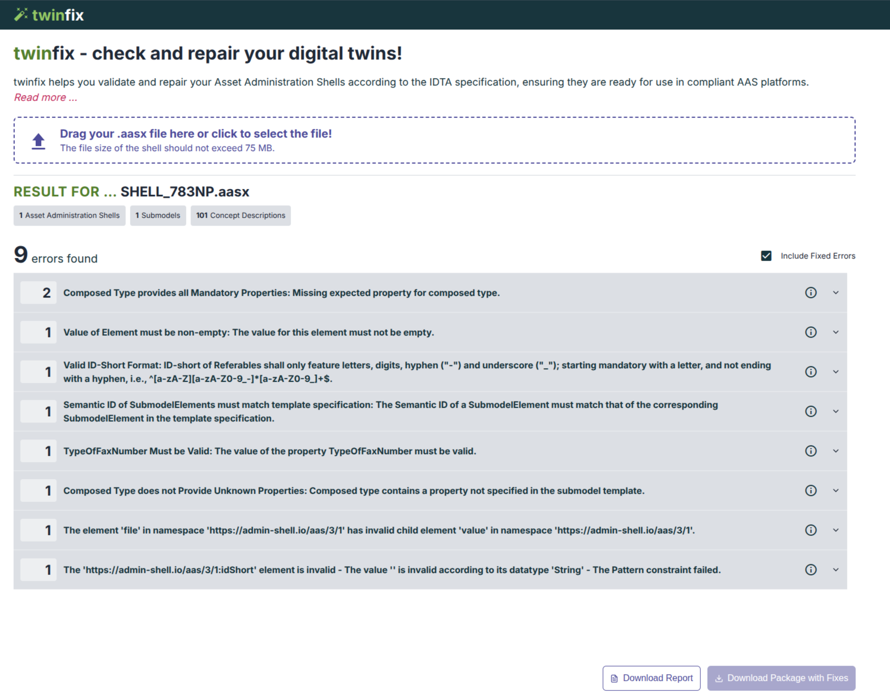
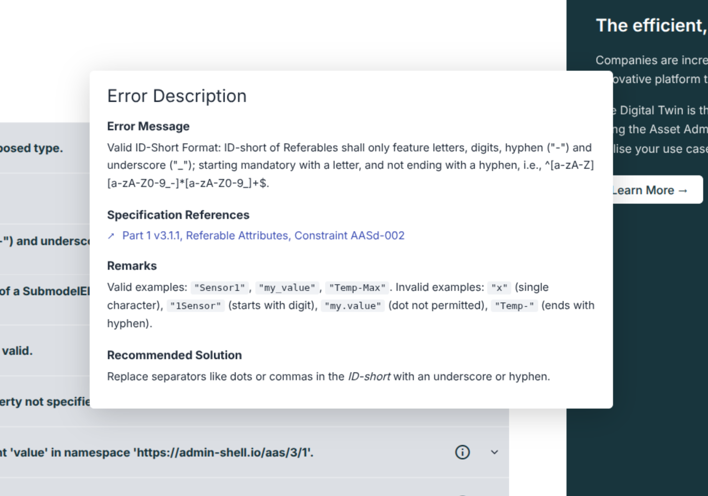

# twinsphere twinfix Documentation

twinfix is a free-to-use service that to check the conformity of AAS packages for common issues. It is publicly
available at <https://twinfix.twinsphere.io>.

## Overivew

twinfix analyzes uploaded `.aasx` packages and displays all validation errors found grouped by error class. It offers a
help screen for many of the common errors including links to relevant parts of the specification and a recommendation on
what to do to address the issue.

At the moment, twinfix supports the following validations:

- AAS Spec Part 1, validations of the meta model language and its normal serializations
- AAS Spec Part 5, validations for the `.aasx` package format
- Specific validations for submodel instances and submodel templates
- Validations for the conformity of submodel instances against the templates that guided their creation

For some errors it even has the power to apply a fix automatically!

{: width='400' }
{: width='400' }
