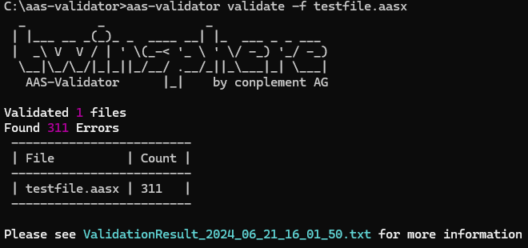
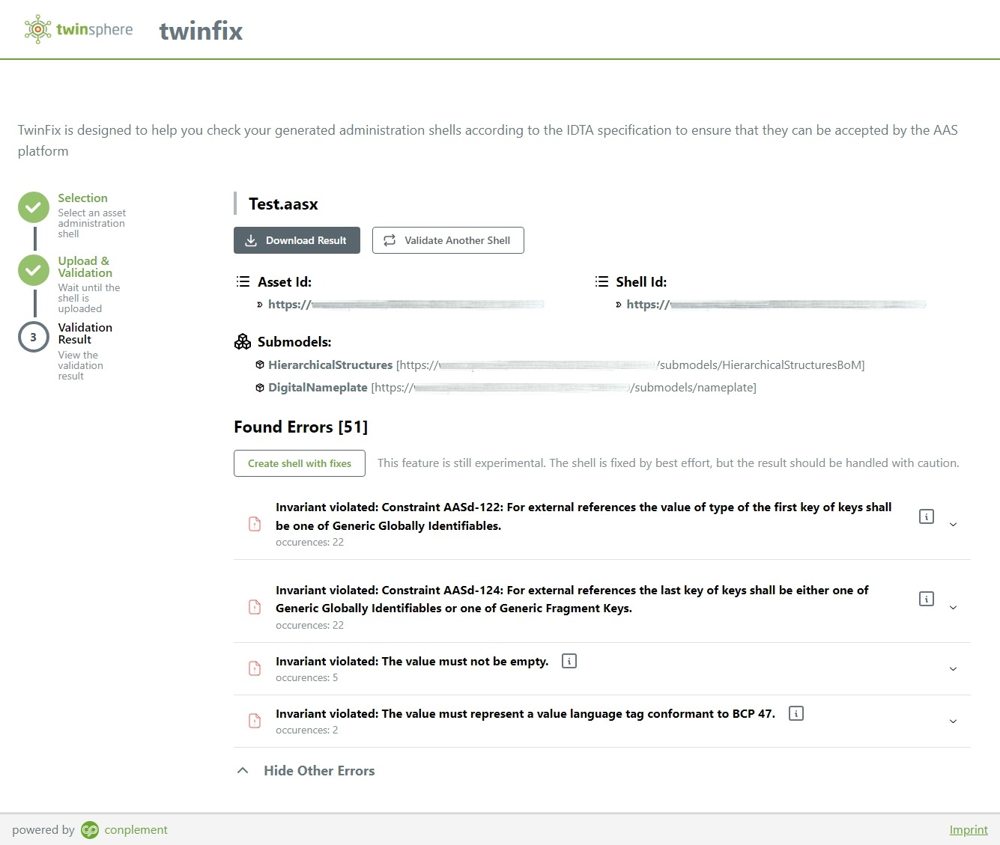
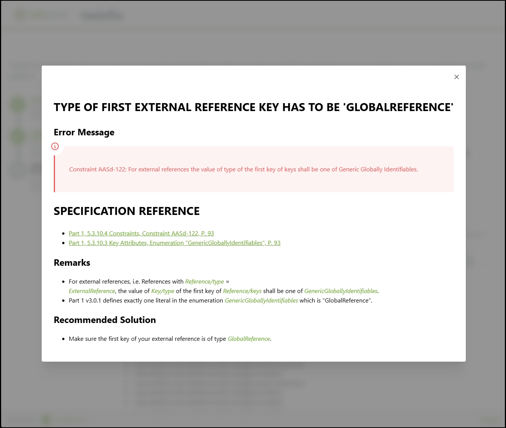

# twinsphere Validator Documentation

We currently offer two tools for checking the conformity of AAS artifacts with the specification.

## twinsphere AAS Validator

A CLI tool exclusively available to our customers.

{: width='400' }

## twinsphere twinfix

A publicly accessible web tool at <https://twinfix.twinsphere.io>.

twinfix analyzes an uploaded AASX package and displays all validation errors found grouped by error class. It offers a
help screen for many of the common errors including links to relevant parts of the specification and a recommendation on
what to do to address the issue.

For some errors it even has the power to apply a fix automatically!

{: width='400' }
{: width='400' }

> *More info and documentation coming soon.*
