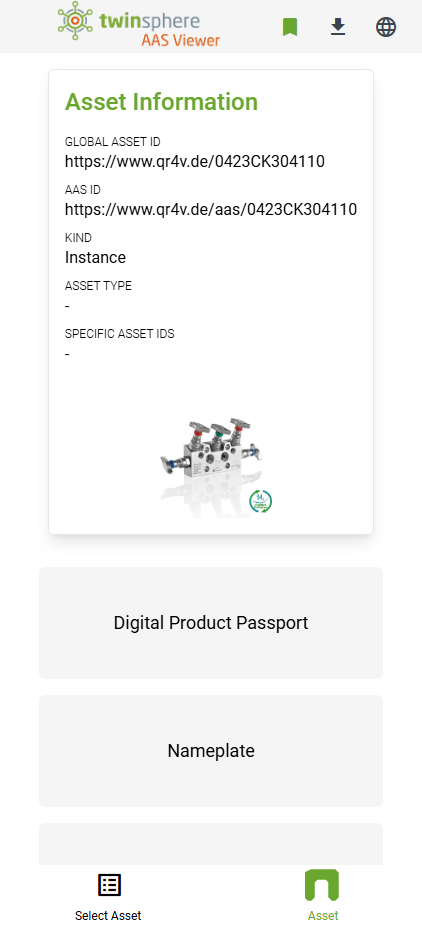
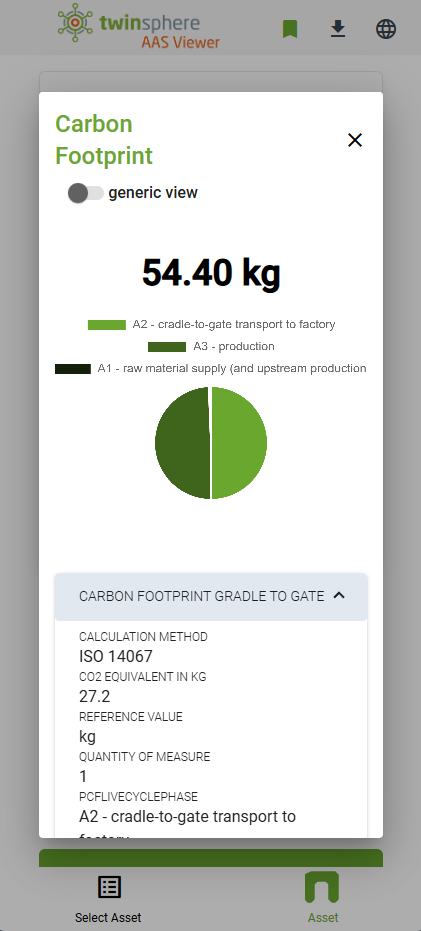

# twinsphere Viewer Overview

The **twinsphere AAS viewer** is a mobile-first designed web viewer for asset administration shells.

It is able to scan a QR-Code on a physical asset containing its *globalAssetId*, do the lookup of its digital twin by an
*AAS Discovery Service* and get the twin's endpoints by querying an *AAS Registry Service*. It then gets the shell and
all its referenced submodels and displays their data nicely to the clients screen.

{: width='200' }
{: width='200' }

## Login

To login into the twinsphere Viewer for your tenant, you will need a *twinsphere ID* account. Please contact the
twinsphere [support team](contact.md) for the configuration. Alternatively you can use your own identity provider
service, configuration instruction can be found in the [identity provider
documentation](cloud-auth.md#identity-provider-federation).
